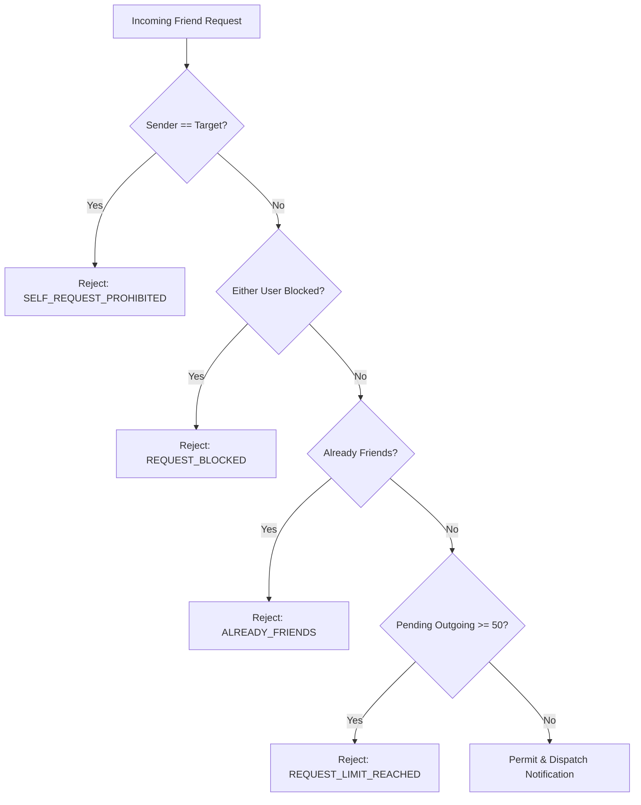

# Zynpath Abuse Prevention & Anti-Fraud Architecture

## 1. Overview and Threat Landscape
Zynpath implements multi-layered safeguards designed to prevent social spam, invitation harassment, billing fraud, ad reward exploitation, and automated scraping.

---

## 2. Social & Invitation Abuse Prevention (`SocialAbuseGuard`)

### Controls
1. **Self-Interaction Prevention**:
   - Sending friend requests or duel invitations to one's own account is strictly disallowed (`SELF_REQUEST_PROHIBITED`).
2. **Bidirectional Block Enforcement**:
   - If Player A blocks Player B, or Player B blocks Player A, all future interaction requests (friend requests, duel invites, room invitations) are immediately denied (`REQUEST_BLOCKED`).
   - Blocked players cannot view the blocking player's online presence.
3. **Pending Request Cap**:
   - Players are capped at a maximum of 50 active pending outgoing friend requests.
   - Prevents bot accounts from blasting requests to arbitrary players.
4. **Scraping & Enumeration Protection**:
   - Player discovery is strictly limited to exact Public Zynpath ID matching (`/api/v1/social/players/search?publicId=...`).
   - Wildcard searches, fuzzy matching, and bulk user directories are intentionally omitted from API contracts.
5. **Rate Limiting**:
   - Friend requests and multiplayer invitations are throttled to 30 requests per minute (`RateLimitPolicy.INVITATIONS_AND_ROOMS`).

---

## 3. Billing & Rewarded-Ad Abuse Prevention (`BillingIntegrityGuard`)

### Google Play Subscription & Purchase Integrity
1. **Token Ownership Binding**:
   - Google Play purchase tokens are cryptographic proofs of purchase.
   - When a purchase token is submitted for verification (`/api/v1/subscription/verify`), `BillingIntegrityGuard.assertPurchaseTokenOwnership` binds the purchase token SHA-256 hash to the authenticated player account.
   - Attempting to submit or replay the same purchase token on a different account fails with `PURCHASE_OWNERSHIP_CONFLICT`.
2. **Authoritative Server Verification**:
   - The Android client boolean `isPremium` is never trusted for server features. Premium puzzle packs and cloud features verify the active subscription directly against Google Play Developer APIs on the backend.
3. **Bounded Offline Policy**:
   - Downloaded Premium packs can be played offline for up to 7 consecutive days without online re-verification. After 7 days, online entitlement refresh is required to decrypt further offline access.

### Rewarded Ad Integrity & Hint Credits
1. **Transaction Deduplication**:
   - Each completed rewarded ad receives a unique `rewardEventId` / `transactionId`.
   - `BillingIntegrityGuard.assertRewardTransactionUnique` verifies that the transaction ID has not been previously claimed or credited. Replayed claim attempts return `REWARD_ALREADY_GRANTED`.
2. **Server-Side Verification (SSV)**:
   - For ad networks supporting Server-Side Verification (AdMob SSV), callbacks are signed by Google with ECDSA public keys (`/api/v1/ads/ssv-callback`).
   - Rewards are credited only after valid cryptographic signature verification.
3. **Wallet Caps & Anti-Inflation**:
   - Hint balances maintain strict caps on daily rewarded ad watches and maximum bonus hint storage to protect game economy balance.

---

## 4. Account Isolation & Sensitive Action Protection

### Data Export & Account Deletion
- **Rate-Limited Sensitive Tier**:
  - `/api/v1/account/export` and `/api/v1/account/me` (DELETE) are governed by `RateLimitPolicy.SENSITIVE` (maximum 5 requests per hour).
- **Session Revocation**:
  - Account deletion immediately purges active sessions (`SessionSecurityService.revokeAllSessionsForPlayer`), disconnects active WebSockets, cleans up notifications, and anonymizes personal data.
- **Audit Logging**:
  - All sensitive actions emit structured audit events (`ACCOUNT_DELETED`, `DATA_EXPORTED`) via `SecurityAuditLogger`, sanitizing any PII or credentials.

---

## 5. Verification Status
- Component implementation: IMPLEMENTED (`SocialAbuseGuard`, `BillingIntegrityGuard`, `RateLimiterService`, `SecurityAuditLogger`).
- Unit/Integration tests: DEFERRED TO FINAL TESTING.
