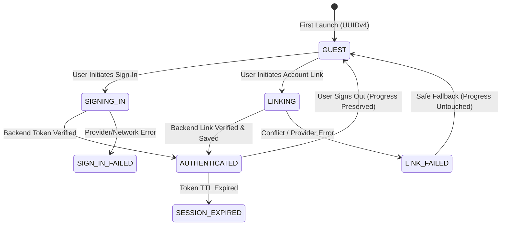

# Zynpath Account Linking & Guest Preservation Architecture

## 1. Overview
Prompt 18 completes the implementation of the authentication and account linking architecture for Google Sign-In and Facebook Login. Zynpath maintains a strict **guest-first, zero-loss** policy: all progress accumulated while playing as a guest is preserved and linked to the authenticated player account upon signing in.

---

## 2. Guest Progress Merge Policy
When a player signs in or links an account with Google or Facebook, the following authoritative reconciliation rules apply:

```
+-------------------------------------------------------------------------------+
|                       Guest Progress Merge Principles                         |
+----------------------+--------------------------------------------------------+
| Data Domain          | Reconciliation Strategy                                |
+----------------------+--------------------------------------------------------+
| Solo Levels          | Union of distinct completed levels.                    |
| Star Ratings         | Higher star rating is retained: max(local, remote).    |
| Personal Best Time   | Faster validated solve time is retained: min(local, r).|
| Daily Challenges     | Union of distinct completed challenge date keys.       |
| Daily Streaks        | Recalculated from union of completed UTC dates.        |
| Achievements         | Combined by stable ID; earlier unlock timestamp saved. |
| Incompatible Sessions| Unfinished active sessions remain intact locally.      |
+----------------------+--------------------------------------------------------+
```

---

## 3. Account States
The application manages explicit authentication and linking states (`com.zynpath.game.core.auth.model.AuthState`):



---

## 4. Conflict Handling (`ACCOUNT_LINK_CONFLICT`)
If a player attempts to link their current guest progress to an external provider identity that is already linked to another Zynpath player account:
- The backend aborts the operation with HTTP `409 Conflict` (`ACCOUNT_LINK_CONFLICT`).
- Local guest records are **never** overwritten or discarded.
- An explicit alert dialog informs the player of the conflict and presents a non-destructive recovery option.

---

## 5. Privacy & Social Graph Isolation
- **Facebook Login Boundary:** Zynpath does not request unnecessary Facebook social graph permissions (`user_friends`, `user_posts`).
- **Friend Invitations:** Multiplayer friend challenges utilize Zynpath's backend-issued Public Zynpath ID (`ZYN-XXXX-YYYY`) and room invite codes.
