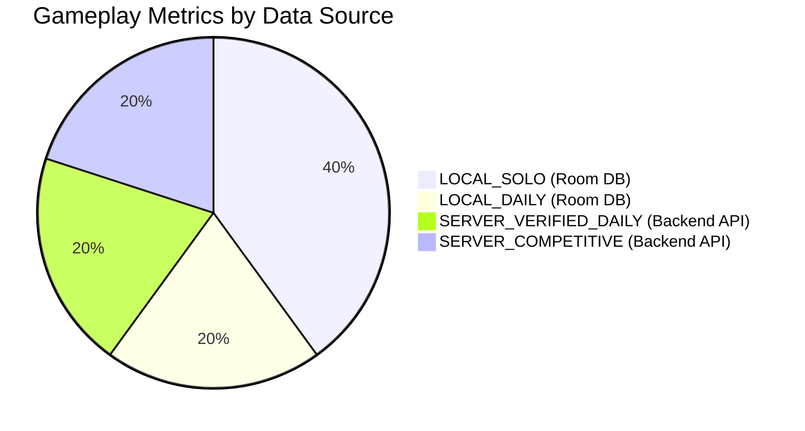

# Zynpath: Analytics Data Sources & Verification Boundaries

## 1. Data Source Classifications

All metrics presented in Zynpath are classified by their authoritative source of truth:

| Source Key | Storage Location | Authority | Offline Capable | Verification Status |
| :--- | :--- | :--- | :--- | :--- |
| `LOCAL_SOLO` | Room Database (`level_progress`) | Client Local | Yes (100%) | Local progress |
| `LOCAL_DAILY` | Room Database (`daily_challenge_history`) | Client Local | Yes (100%) | Provisional client completion |
| `SERVER_VERIFIED_DAILY` | Backend Daily Service | Server Authoritative | Cached (Read-only) | Cryptographically validated solution |
| `SERVER_COMPETITIVE` | Backend Multiplayer Service | Server Authoritative | Cached (Read-only) | Real-time validated match session |

---

## 2. Source Boundaries & Guarantees

### 2.1 `LOCAL_SOLO`
- **Store:** `LevelProgressDao`.
- **Scope:** Canonical levels 1–300 across Worlds 1–6.
- **Guarantee:** Instantaneous local updates upon completion. Available fully offline without network connectivity or account sign-in.
- **Isolation:** Premium Solo pack progress is stored in `PremiumPackRepository` and never mixed into the 300 canonical levels.

### 2.2 `LOCAL_DAILY` vs. `SERVER_VERIFIED_DAILY`
- **Distinction:** A daily challenge completed offline is stored locally as a provisional record.
- **Streaks:** Local streaks continue uninterrupted even when offline.
- **Leaderboard Eligibility:** Only server-authoritative runs (`SERVER_VERIFIED_DAILY`) where the solution was validated against the server puzzle engine within the active challenge window are eligible for official leaderboard rankings and competitive daily timing insights.
- **Presentation:** The calendar grid displays distinct indicators: ForestMint for verified runs, AccentGold for local provisional runs, and dark cards for missed challenges.

### 2.3 `SERVER_COMPETITIVE`
- **Store:** Backend `CompetitiveService` and match session store.
- **Scope:** Quick Duel (1v1), Friend Duel (1v1), and Mini League (4-player).
- **Integrity:** Matches must be finalized with authoritative validation outcomes. In-progress, cancelled, or aborted matches without decisive action are handled according to documented forfeit/abandonment rules.
- **Offline / Stale State:** When offline, the app displays previously fetched competitive snapshots clearly marked with cached timestamps.
