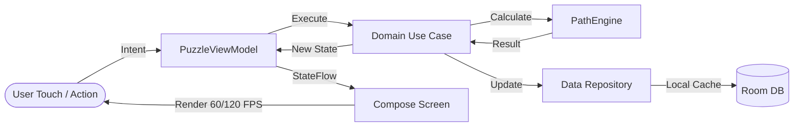

# Zynpath Android Client Architecture

**Target Platform:** Native Android (Min SDK 24, Target SDK 35)  
**Primary UI Toolkit:** Jetpack Compose + Material 3  
**Architecture Pattern:** Clean Architecture + MVI (Model-View-Intent)  

---

## 1. Architectural Layers

```
┌─────────────────────────────────────────────────────────────┐
│                    PRESENTATION LAYER                       │
│  - Jetpack Compose Screens & Material 3 Theme               │
│  - ViewModels & StateFlow (Single Source of Truth)          │
│  - Custom Hardware-Accelerated Canvas Path Renderer         │
│  - PointerInput Drag Gesture Handler (Center-Snapped)       │
└──────────────────────────────┬──────────────────────────────┘
                               │ State / User Intents
┌──────────────────────────────▼──────────────────────────────┐
│                       DOMAIN LAYER                          │
│  - Pure Kotlin Puzzle Engine (Zero Android Framework deps)  │
│  - Use Cases (ValidateMove, RequestHint, SolveLevel)        │
│  - Domain Models (Grid, Cell, Checkpoint, Wall, Path)       │
│  - Business Rules & Win Condition Validators                │
└──────────────────────────────┬──────────────────────────────┘
                               │ Data Operations
┌──────────────────────────────▼──────────────────────────────┐
│                        DATA LAYER                           │
│  - Repository Implementations & Data Sources                │
│  - Room Database (Local Level Progress, Stars, Stats)       │
│  - Jetpack DataStore (User Preferences, Audio, Haptics)     │
│  - Remote Network Clients (Retrofit REST, OkHttp WebSocket) │
└─────────────────────────────────────────────────────────────┘
```

---

## 2. Presentation Layer & Jetpack Compose Canvas

### 2.1 Center-Snapped Drag Gesture Detector
Path drawing is powered by a high-frequency custom touch detector attached to the puzzle board Canvas:

```kotlin
// Conceptual Compose gesture integration
Modifier.pointerInput(gridState) {
    detectDragGestures(
        onDragStart = { offset -> viewModel.onIntent(PuzzleIntent.StartDrag(offset)) },
        onDrag = { change, _ ->
            change.consume()
            viewModel.onIntent(PuzzleIntent.DragTo(change.position))
        },
        onDragEnd = { viewModel.onIntent(PuzzleIntent.EndDrag) },
        onDragCancel = { viewModel.onIntent(PuzzleIntent.CancelDrag) }
    )
}
```

### 2.2 Offset to Cell Coordinate Mapping
The board layout calculates exact bounds for each cell $[r, c]$:
$$\text{col} = \left\lfloor \frac{x - \text{boardPaddingX}}{\text{cellSize}} \right\rfloor, \quad \text{row} = \left\lfloor \frac{y - \text{boardPaddingY}}{\text{cellSize}} \right\rfloor$$
- Bounds are clamped and checked against grid dimensions.
- If $(row, col)$ represents an adjacent step from the current path head:
  - Movement is passed to `MovementValidator`.
  - On approval, the segment is added to the active path and haptic feedback is triggered.
- If $(row, col)$ is the cell immediately prior to the head:
  - An intuitive **reverse-drag undo** occurs, smoothly retracting the path head.

### 2.3 Canvas Rendering Performance (120 FPS Target)
- Grid lines, background tiles, and fixed walls are drawn efficiently using pre-cached Paths.
- The active polyline is rendered using hardware-accelerated anti-aliased strokes with round caps and joins (`StrokeCap.Round`, `StrokeJoin.Round`).
- Checkpoints are rendered with circular badges displaying numbers centered with `drawText`.

---

## 3. Unidirectional Data Flow (MVI)



### 3.1 Immutable UI State
```kotlin
data class PuzzleUiState(
    val grid: PuzzleGrid,
    val activePath: List<Coordinate> = emptyList(),
    val currentHead: Coordinate? = null,
    val coveredCellsCount: Int = 0,
    val requiredCellsCount: Int = 0,
    val nextRequiredCheckpoint: Int = 1,
    val isComplete: Boolean = false,
    val isDeadEnd: Boolean = false,
    val remainingHints: Int = 3,
    val activeHintPath: List<Coordinate>? = null,
    val elapsedSeconds: Long = 0L,
    val isPaused: Boolean = false
)
```

---

## 4. Local Data Persistence

### 4.1 Room Database Architecture
- `LevelProgressEntity`: Stores completion state, best time, stars earned (1–3), and move count per level.
- `PlayerStatsEntity`: Total levels cleared, streak count, total stars, perfect runs.
- `DailyChallengeEntity`: Date key, solved status, completion time.

### 4.2 Preferences DataStore
- Audio volume & sound effects toggle.
- Haptic vibration feedback toggle.
- Active theme selection (Default Forest, Midnight Neon, Minimalist).
- Local anonymous guest UUID.

---

## 5. Dependency Injection (Hilt / Kotlin Inject)

Modules are separated by lifecycle:
- `AppModule`: Singleton application context, DataStore instances, CoroutineDispatchers.
- `DatabaseModule`: Room database instance, DAO providers.
- `NetworkModule`: OkHttp, Retrofit, WebSocket factory with connection pooling.
- `EngineModule`: Stateless validators and puzzle generator providers.
