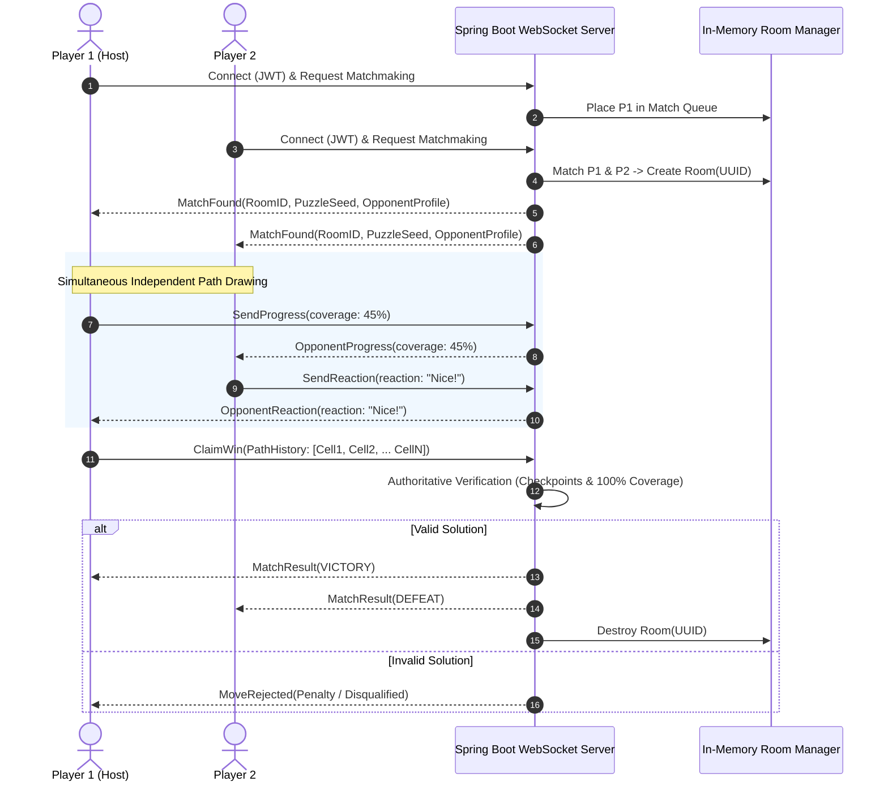

# Zynpath Master Architecture

**Version:** 1.0.0  
**Status:** Authoritative  
**Domain:** System-Wide Architectural Blueprint  

---

## 1. High-Level Architecture Overview

Zynpath is built upon a decoupled, offline-first client architecture paired with a lightweight, cost-optimized real-time backend. 

```mermaid
graph TB
    subgraph "Android Client (Kotlin + Jetpack Compose)"
        UI[Presentation Layer: Jetpack Compose / MVI]
        VM[ViewModels & UI State Holders]
        Engine[Core Domain: Pure Kotlin Puzzle Engine]
        Data[Data Layer: Repository Pattern]
        Room[(Local Room Database)]
        DataStore[DataStore Preferences]
        NetClient[Network / WebSocket Client]
    end

    subgraph "Backend Services (Java 17+ / Spring Boot 3)"
        WSHandler[WebSocket / STOMP Broker]
        RoomMgr[Ephemeral GameRoom Manager (RAM)]
        ServerValidator[Authoritative Puzzle Validator]
        Matchmaker[Matchmaking Engine]
        AuthFilter[Firebase JWT Auth Filter]
        DBService[Storage Service (Repository Abstraction)]
    end

    subgraph "External Cloud Services"
        FirebaseAuth[Firebase Authentication]
        AdMob[Google AdMob]
        PlayBilling[Google Play Billing]
        CloudDB[(Production DB: PostgreSQL / Firestore)]
    end

    UI --> VM
    VM --> Engine
    VM --> Data
    Data --> Room
    Data --> DataStore
    Data --> NetClient

    NetClient <==>|WSS / JSON Messages| WSHandler
    WSHandler --> AuthFilter
    WSHandler --> RoomMgr
    RoomMgr --> ServerValidator
    RoomMgr --> Matchmaker
    RoomMgr --> DBService
    DBService --> CloudDB

    Data --> FirebaseAuth
    UI --> AdMob
    Data --> PlayBilling
```

---

## 2. Core Architectural Principles

1. **Offline Autonomy**: Solo gameplay operates without network dependency. Puzzle generation, validation, hint calculations, and local progress run entirely on-device.
2. **Deterministic Domain Isolation**: The continuous-path puzzle engine is written in pure Kotlin with zero Android framework dependencies (`android.*`). This guarantees 100% testability with instant JUnit 5 execution.
3. **Client-Authoritative Rendering, Server-Authoritative Competition**:
   - The client renders paths at 60/120 FPS using high-performance hardware-accelerated Compose Canvas.
   - For multiplayer, the server validates the win claim by re-verifying the solution step sequence before awarding match victory.
4. **Zero-Waste Network Footprint**: Raw touch inputs (finger X/Y offsets) are never broadcast. Only discrete state transitions (progress percentage, completion claim, reaction payloads) are transmitted.
5. **Ephemeral State for Volatile Data**: Active multiplayer rooms, live match timers, and temporary player reactions live strictly in memory and are discarded upon match termination.

---

## 3. Client Architecture (Native Android)

The Android application follows Google's Recommended Architecture Guide combined with Clean Architecture and Uni-directional Data Flow (MVI):

```
android/
├── app/                      # Application entrypoint, Hilt modules
└── core/
    ├── domain/               # Pure Kotlin domain (Entities, Validators, Engine)
    │   ├── model/            # Grid, Cell, Checkpoint, Wall, Path, Move
    │   ├── engine/           # PathEngine, PuzzleGenerator, PuzzleSolver
    │   ├── validator/        # MovementValidator, CheckpointValidator, CoverageValidator
    │   └── usecase/          # ValidateMoveUseCase, SolvePuzzleUseCase, GetHintUseCase
    ├── data/                 # Data layer (Entities, DAOs, Repositories, Mappers)
    │   ├── local/            # Room DB (LevelProgress, Stats), DataStore (Settings)
    │   ├── remote/           # Retrofit REST & OkHttp WebSocket clients
    │   └── repository/       # LevelRepositoryImpl, UserRepositoryImpl, MatchRepositoryImpl
    └── ui/                   # Shared UI components, Design System, Canvas renderers
        ├── theme/            # Color, Type, Shape, Elevation
        ├── components/       # CheckpointCircle, GridBorder, PathRenderer, ReactionBubble
        └── canvas/           # Custom hardware-accelerated grid path drawing
```

---

## 4. Backend Architecture (Spring Boot 3)

The backend service is engineered to run cost-effectively on a minimal memory footprint (e.g., standard container or micro-instance) without heavy distributed dependencies:

```
backend/
├── src/main/java/com/zynpath/
│   ├── config/               # WebSocketConfig, SecurityConfig, FirebaseConfig
│   ├── controller/           # REST endpoints (Profile, DailyChallenge, Leaderboards)
│   ├── websocket/            # STOMP / Raw WebSocket Handlers for Duels & Leagues
│   ├── model/                # User, MatchRoom, PlayerSession, ReactionEvent
│   ├── service/
│   │   ├── MatchmakingService.java      # Quick Duel & Mini League queue manager
│   │   ├── RoomSessionManager.java      # ConcurrentHashMap ephemeral room registry
│   │   ├── PuzzleVerificationService.java # Headless puzzle solution validator
│   │   └── ReactionRelayService.java    # Rate-limited in-memory reaction broadcaster
│   └── repository/           # Spring Data JPA / Firestore interface abstractions
```

### 4.1 Ephemeral Room Lifecycle



---

## 5. Security & Authentication Architecture

1. **Guest-First (Anonymous Identity)**:
   - On initial launch, an anonymous identifier is minted locally using UUIDv4 stored in encrypted DataStore.
   - The user can play 100% of solo content without any cloud network handshake.
2. **Account Linking**:
   - When transitioning to online multiplayer, Firebase Auth exchanges credentials (Google Sign-In OAuth token or Facebook Access Token) into a Firebase UID.
   - If an anonymous Firebase account was active, `linkWithCredential` merges local achievements, level completions, and statistics without data loss.
3. **Transport Security**:
   - All network traffic is strictly enforced over TLS 1.3 (`https://` and `wss://`).
   - Debug builds allow local IP connections for LAN testing; release builds enforce Android Network Security Config with cleartext traffic disabled.

---

## 6. Technology Stack Decision Log

| Component | Selected Technology | Alternative Evaluated | Key Rationale |
|---|---|---|---|
| **Android UI** | Jetpack Compose (Material 3) | Traditional XML Views | Declarative state binding, superior animation APIs, custom Canvas efficiency. |
| **Puzzle Engine** | Pure Kotlin Multiplatform-ready | Native C++ / NDK | Zero JNI overhead, instantaneous compilation, clean unit testability, shared logic. |
| **Realtime Transport** | WebSocket / STOMP | HTTP Long Polling / gRPC | Low-latency duplex messaging, lightweight JSON frames, native mobile SDK support. |
| **Multiplayer State** | Java In-Memory Concurrency | Redis Cluster | Zero external infrastructure bill, sufficient for 2-5 player rooms at target scale. |
| **Reactions** | Preset Enums (Ephemeral RAM) | Persistent Chat DB | Zero moderation overhead, zero storage cost, zero legal liabilities for UGC. |
| **Monetization** | AdMob + Google Play Billing | Unity Ads / In-house | Native Google ecosystem integration, highest fill rates in target markets. |
