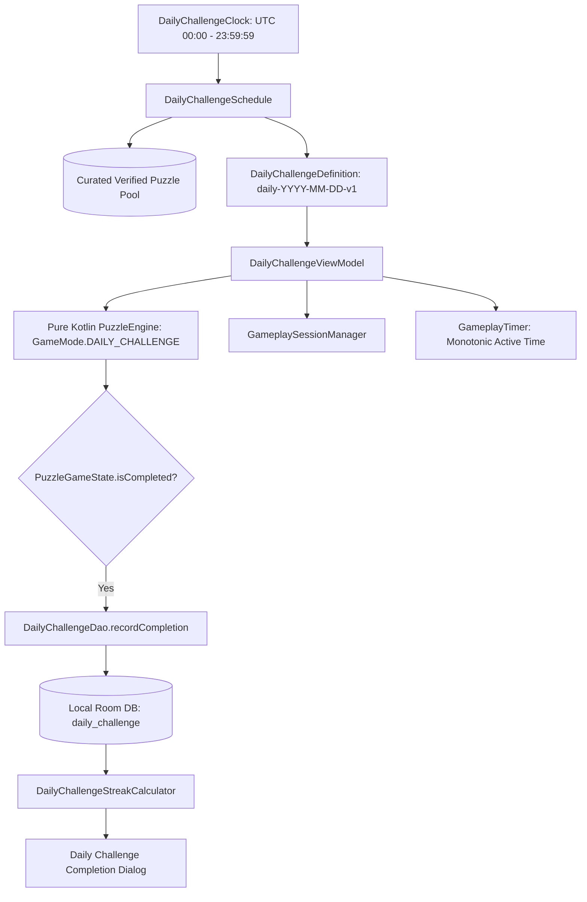

# Zynpath Daily Challenge Foundation & Offline Participation

**Status:** Authoritative  
**Domain:** Phase 4 — Daily Challenge Foundation (Prompt 16/50)  

---

## 1. Architectural Overview

The **Daily Challenge** provides a globally synchronized, date-indexed continuous-path puzzle every 24 hours. Designed with an offline-first architecture, each challenge is deterministically mapped from a curated pool of solver-verified puzzles, allowing full offline participation, local streak tracking, and idempotent progress saving without requiring account creation, login, or cloud network connectivity.

---

## 2. Canonical UTC Date Policy

- **Authoritative Date Boundary:** 00:00:00 UTC through 23:59:59.999 UTC.
- **Timezone Invariance:** Challenges do not shift or fragment based on local device timezones. All players worldwide participate in the exact same challenge during the canonical UTC window.
- **Local Time Display:** The reset time is converted to the player's local timezone for clarity (e.g. countdown displayed as "Resets in 7h 24m").
- **Injectable Clock:** All date determinations route through [`DailyChallengeClock`](file:///d:/Zynpath/android/app/src/main/java/com/zynpath/game/core/puzzle/daily/DailyChallengeClock.kt), enabling robust unit testability and time-travel assertions without altering system clocks.

---

## 3. Challenge Identity & Deterministic Scheduling

Every Daily Challenge is identified by an immutable composite identity:
- **`challengeId`**: Format `daily-YYYY-MM-DD-v1` (e.g., `daily-2026-09-26-v1`).
- **`dateKey`**: Canonical `YYYY-MM-DD` string.
- **`scheduleVersion`**: Semantic version of the schedule mapping (`1.0.0`).
- **`puzzleId`**: Identifier of the underlying puzzle (e.g., `w2_lvl21`).
- **`puzzleFingerprint`**: SHA-256 canonical hash of the puzzle topology and wall structure.

### Deterministic Hash Mapping
To guarantee that the assignment never varies across JVM implementations, language runtimes, or CPU architectures, the challenge assignment computes a cryptographic SHA-256 digest:
$$\text{Digest} = \text{SHA-256}(\text{scheduleVersion} + ":" + \text{dateKey})$$
$$\text{PoolIndex} = \text{UInt32}(\text{Digest}[0..3]) \pmod{\text{PoolSize}}$$

The puzzle at `PoolIndex` within the curated [`DailyChallengePool`](file:///d:/Zynpath/android/app/src/main/java/com/zynpath/game/core/puzzle/daily/DailyChallengePool.kt) is assigned. The same inputs guarantee identical output every time.

---

## 4. Curated & Verified Puzzle Pool

Every puzzle in the Daily Challenge pool strictly satisfies:
1. **Structural Validation:** Pass all checks in `PuzzleDefinitionValidator`.
2. **Exhaustive Solvability:** Verified solution route covering 100% of required cells.
3. **Ascending Checkpoints:** All checkpoints visited in strict ascending order starting from 1.
4. **Completion Authority:** Validated against `CompletionValidator`.
5. **Fingerprint Verification:** Immutable SHA-256 hash preventing modification or corruption.

The initial schedule pool contains **14 verified puzzles** spanning 4×4 beginner routes, 5×5 open paths, 5×5 wall barriers, and 6×6 advanced labyrinths.

---

## 5. Participation & Availability States

[`DailyChallengeAvailability`](file:///d:/Zynpath/android/app/src/main/java/com/zynpath/game/core/puzzle/daily/DailyChallengeAvailability.kt) models the lifecycle:
- **`AVAILABLE`**: Challenge is ready for today and has not yet been attempted.
- **`IN_PROGRESS`**: Challenge has an active unfinished attempt for today.
- **`COMPLETED`**: Validated engine victory achieved; attempt time recorded.
- **`NOT_YET_AVAILABLE`**: Future calendar date.
- **`EXPIRED`**: UTC date has passed without completion.
- **`ASSET_UNAVAILABLE`**: Offline asset missing.
- **`ASSET_INVALID`**: Cryptographic integrity failure.

---

## 6. Competitive Fairness & Hint Policy

- **No Solution Hints:** In `GameMode.DAILY_CHALLENGE`, solution-revealing hints are strictly disabled (`GameMode.allowsHints == false`) to maintain competitive parity.
- **Free Undo & Reset:** Undo and Reset actions remain free and non-penalized.
- **Monotonic Active Timer:** Timer only ticks during active user interaction, pausing automatically during dialogs, backgrounding, and navigation away.

---

## 7. Session Restoration & Expiration Policy

1. **Attempt ID Isolation:** Daily sessions are isolated by `sessionId = "daily_${challengeId}"`.
2. **Restoration Verification:** Before restoring an in-progress attempt, the snapshot schema, `puzzleId`, and `puzzleVersion` are validated. The saved path is replayed through the authoritative engine to verify rule compliance.
3. **No Cross-Day Carryover:** If a previous session exists for an earlier date, it is marked expired and is never restored as today's challenge attempt.

---

## 8. Local Streak Calculation

[`DailyChallengeStreakCalculator`](file:///d:/Zynpath/android/app/src/main/java/com/zynpath/game/core/puzzle/daily/DailyChallengeStreakCalculator.kt) evaluates local streaks against strictly consecutive UTC calendar dates:
- **Streak Preservation:** If today's challenge is not yet solved, the streak is maintained if yesterday was completed.
- **Streak Increment:** Solving today's challenge extends the streak by 1 day.
- **Streak Reset:** If neither today nor yesterday was completed, the streak resets to 0.
- **All-Time Best:** Tracks the longest historical streak across all completed dates.

---

## 9. Server Authority, Online Verification & Daily Leaderboard (Prompt 25)

The Daily Challenge system connects the offline-first experience with a server-authoritative competitive leaderboard:
- **Canonical Puzzle Alignment**: Both client and server share the identical 14-puzzle curated pool and SHA-256 fingerprint generator.
- **Server-Issued Attempt**: Authenticated players invoke `POST /api/daily/attempt/start` to obtain a cryptographically bound attempt UUID and authoritative start timestamp.
- **Independent Server Path Validation**: Upon completion, the client submits the move path to `POST /api/daily/attempt/submit`. `ServerPuzzleValidator` simulates every move, validating starting checkpoint, orthogonal steps, wall barriers, checkpoint ascending sequence, and full cell coverage.
- **Server-Authoritative Timing**: Elapsed time is computed as server completion receipt time minus server attempt start time. Local stopwatch times are never used for global ranking.
- **Official Daily Leaderboard**: Scoped to the specific UTC date. Ties share equal ranks using Standard Competition Ranking (1, 2, 2, 4...).
- **Offline / Guest Safety**: Offline and guest completions are tagged `LOCAL_COMPLETION` or `PROVISIONAL`. Reconnecting syncs metadata without falsely promoting unverified times to the competitive leaderboard.
- **Verification Badges**: The UI clearly displays `LOCAL COMPLETION`, `PROVISIONAL`, `SERVER-VALIDATED`, `LEADERBOARD-ELIGIBLE`, or `NOT ELIGIBLE`.

---

## 10. Profile & Achievement Integration (Prompts 17 & 25)

Daily Challenge outcomes feed player identity, profile progression, and achievements:
- **`daily_first_dawn`**: Unlocks upon first validated Daily Challenge completion.
- **`daily_three_streak`**: Unlocks upon maintaining a 3-day consecutive UTC streak.
- **`daily_seven_streak`**: Unlocks upon maintaining a 7-day consecutive UTC streak.
- **`daily_server_validated` (Prompt 25)**: "Official Pathfinder" — First server-validated Daily Challenge completion.
- **`daily_leaderboard_ranked` (Prompt 25)**: "On the Board" — Ranked on the official Daily Leaderboard.
- **Profile Statistics**: Aggregates total completed challenges, active consecutive day streaks, and verified server completions directly from `DailyChallengeRepository`.

---

## 11. Daily Challenge Analytics & Calendar Insights (Prompt 30)

- **14-Day Calendar Matrix (`DailyCalendarGrid`)**: Accessible calendar indicator rendering each UTC day with color-coded status badges:
  - `SERVER_VERIFIED`: ForestMint circle with checkmark.
  - `LOCAL_PROVISIONAL`: AccentGold circle with checkmark.
  - `MISSED`: Neutral background with border.
- **Verification Boundaries**: Solves completed offline are cleanly classified as `LOCAL_DAILY` and never conflated with `SERVER_VERIFIED_DAILY` records.
- **Timing Analytics**: Fastest and average solve times are calculated strictly across server-validated runs to prevent client clock skew from polluting competitive timing benchmarks.

---

## 12. Daily Challenge Local Reminders (Prompt 31)

- **Optional Local Reminders**: Players can enable daily challenge reminders in Settings. Reminders are opt-in and disabled by default.
- **Inexact Local Scheduling**: Scheduled via `AlarmManager.setInexactRepeating` using the player's local device timezone (default: 09:00 local time). Avoids exact-alarm permissions.
- **Completion Suppression**: `DailyChallengeReminderReceiver` queries `DailyChallengeDao`. If today's challenge is already completed locally, the reminder is automatically suppressed.
- **Reboot Resilience**: `BootCompletedReceiver` restores scheduled reminders on device restart without maintaining an active background service.

---

## 13. Offline-First Daily Challenge Synchronization (Prompt 35)
- **Local Participation Authority**: Completing a Daily Challenge offline durably saves the attempt in `daily_challenge` with status `LOCAL_COMPLETION` and enqueues an operation in `sync_operations`.
- **Provisional Sync Upon Reconnect**: When network connectivity is restored, `SyncCoordinator` submits the provisional record to `POST /api/v1/sync/batch` (which delegates to `DailyChallengeService.syncProvisional`).
- **Leaderboard Safeguards**: Offline provisional sync preserves player streaks and calendar badges without polluting official timed competitive leaderboards. Timed leaderboard qualification requires live official attempts started via `startOfficialAttempt` within the UTC submission window.

---

## 14. Submission Recovery & Verification Reliability (Prompt 38)
- **Zero False Verification Claims**: If submitting an official Daily Challenge attempt fails due to network drop or backend outage, the result is never marked `SERVER_VERIFIED`. The local completion is durably preserved as `LOCAL_PROVISIONAL`.
- **Durable Local Participation**: The user's streak and completion status are immediately committed in Room (`daily_challenge`). Network failure never revokes local streak progression or requires replaying the daily puzzle.
- **Canonical UTC Identity**: Date keys are strictly anchored to canonical UTC midnight (`YYYY-MM-DD`). Device timezone adjustments or travel across timezones cannot corrupt streak calculation or duplicate daily participation.

---

## 15. Accessibility & Non-Color Feedback (Prompt 39)
- **LiveRegion Move Rejection Announcements**: Rejection messages attach `liveRegion = LiveRegionMode.Polite` with contextual content descriptions, announcing errors politely via TalkBack without visual flash reliance.
- **Dual-Layer Board Accessibility**: Reuses `PuzzleBoard` virtual cell grid overlay with full TalkBack traversal, cell descriptions (row/col, checkpoint, path head, wall edges), and hardware keyboard / D-pad support.
- **Verification Status Disambiguation**: Clear textual badges distinguish "Saved on this device", "Waiting to sync", "Server Verified", and "Verification Pending" without relying solely on color.

---

## 16. Respectful Engagement & Achievement Verification Safeguards (Prompt 41)
- **Non-Manipulative Streak Messaging**: Streaks are presented as an empowering, optional milestone marker. Inactive days reset the counter gracefully without shame alerts, guilt-inducing reminders, or artificial penalties.
- **Strict Verification Gate for Achievements**:
  - `daily_server_validated` achievement is **only** awarded when `DailyChallengeRecord.verificationStatus == "VERIFIED"`. Local completions or pending submissions do not trigger this achievement.
  - `daily_leaderboard_ranked` achievement is awarded only when `isLeaderboardEligible == true`.
- **Integrated Daily Evaluation**: `AchievementRepository.evaluateAll()` runs on every Daily Challenge solve, checking local participation (`daily_first_dawn`), UTC streaks (`daily_three_streak`, `daily_seven_streak`), and verified status.

---

## 17. Production Database Schema & UTC Scheduling Stability (Prompt 44)
- **Authoritative Attempt Persistence (`V1__baseline_core_accounts_and_profiles.sql`)**: Server-validated daily attempts are recorded in `daily_challenge_attempts` with a composite unique constraint `UNIQUE (player_id, challenge_date)`. A player's validated solve cannot be overwritten or duplicated.
- **Canonical UTC Identity Across Restarts**: Daily challenge dates are strictly calculated from UTC midnight (`Instant.now().atZone(ZoneOffset.UTC).toLocalDate()`). Backend restarts or redeployments generate the exact same puzzle seed for that UTC date.
- **Solver-Verified Guarantee**: Every issued daily puzzle is generated using the solver-verified catalog pipeline with 100% cell coverage and ascending checkpoint order validation. Performance tuning never bypasses solver verification.

---

## 18. Backend Daily Challenge Integration & Verification (Prompt 47)

### 18.1 Test Execution Summary (`DailyChallengeIntegrationTest`)
- **Suite**: `com.zynpath.backend.daily.DailyChallengeIntegrationTest`
- **Total Tests**: 6 / 6 PASSED (100% Pass Rate).
- **Verified Behaviors**:
  1. `getDailyChallenge_shouldReturnCanonicalUtcChallenge`: Confirms that `GET /api/v1/daily/today` returns the canonical daily challenge with deterministic SHA-256 puzzle fingerprint.
  2. `startAttempt_shouldCreateOfficialAttempt`: Issues an official attempt ID bound to the authenticated player and records server start timestamp.
  3. `submitSolution_withValidRoute_shouldVerifyAndRecordTime`: Validates route through `ServerPuzzleValidator`, calculates authoritative solve duration, and records completion in database.
  4. `submitSolution_withInvalidRoute_shouldReject`: Rejects skipped checkpoints, revisit loops, and incomplete coverage with HTTP 400 Bad Request.
  5. `duplicateSubmission_shouldBeRejectedOrIdempotent`: Prevents duplicate completion entries for the same official attempt.
  6. `getDailyLeaderboard_shouldReturnPartitionedStandings`: Returns partitioned UTC daily standings with standard competition ranking.

### 18.2 Full Execution Report
- Complete execution details recorded in [`docs/DAILY_CHALLENGE_TEST_REPORT.md`](file:///d:/Zynpath/docs/DAILY_CHALLENGE_TEST_REPORT.md).

