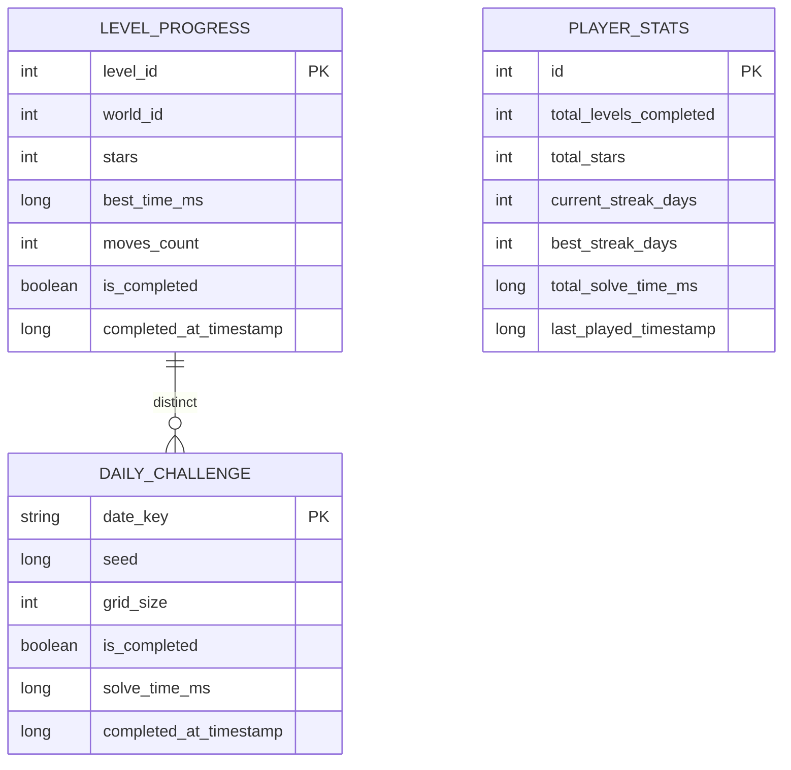
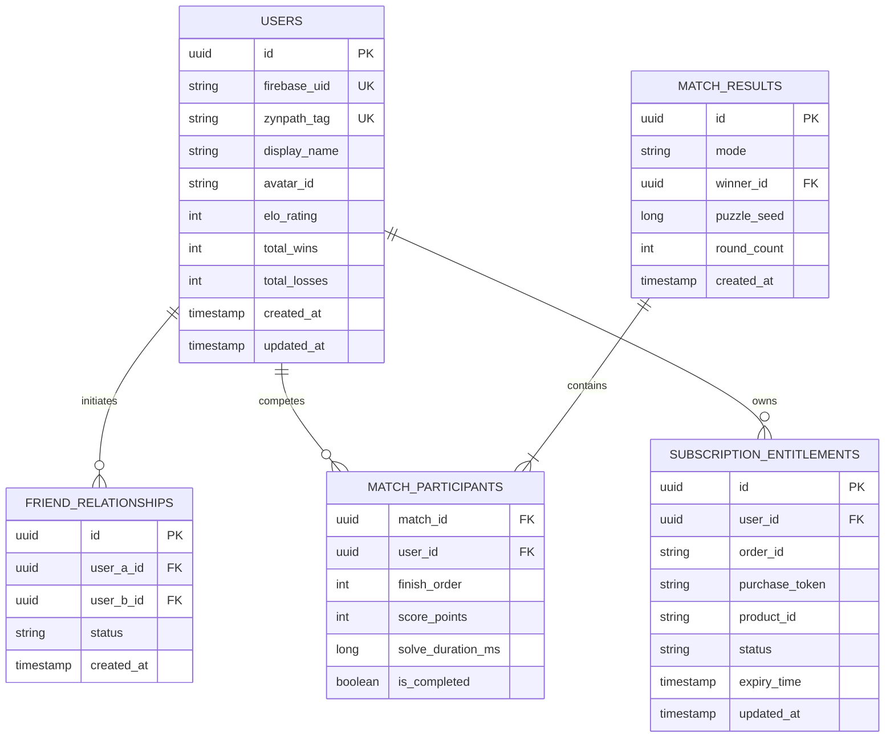

# Zynpath Database & Schema Design

**Status:** Authoritative  
**Scopes:** Local Client (Android Room & DataStore) & Cloud Persistence (PostgreSQL / Firestore)  

---

## 1. Client-Side Database Schema (Android Room)

Local persistence powers the complete offline Solo experience. The Room database is designated `zynpath_database.db`.



### 1.1 Room Entity Definitions (Kotlin)

```kotlin
@Entity(tableName = "level_progress")
data class LevelProgressEntity(
    @PrimaryKey val levelId: Int,
    val worldId: Int,
    val stars: Int, // 1 to 3
    val bestTimeMs: Long,
    val movesCount: Int,
    val isCompleted: Boolean,
    val completedAt: Long
)

@Entity(tableName = "player_stats")
data class PlayerStatsEntity(
    @PrimaryKey val id: Int = 1, // Singleton row
    val totalLevelsCompleted: Int = 0,
    val totalStars: Int = 0,
    val currentStreakDays: Int = 0,
    val bestStreakDays: Int = 0,
    val totalSolveTimeMs: Long = 0L,
    val lastPlayedTimestamp: Long = 0L
)

@Entity(tableName = "daily_challenge")
data class DailyChallengeEntity(
    @PrimaryKey val dateKey: String, // Format: YYYY-MM-DD
    val seed: Long,
    val gridSize: Int,
    val isCompleted: Boolean = false,
    val solveTimeMs: Long = 0L,
    val completedAt: Long = 0L
)
```

---

## 2. Client-Side Preferences (Jetpack DataStore)

Key-value preferences are managed via Protobuf / Preferences DataStore (`zynpath_preferences`):

| Key | Type | Default Value | Description |
|---|---|---|---|
| `key_guest_uuid` | `String` | Auto-generated UUIDv4 | Anonymous player identifier. |
| `key_sfx_enabled` | `Boolean` | `true` | Sound effects toggle. |
| `key_haptics_enabled` | `Boolean` | `true` | Tactile vibration feedback. |
| `key_selected_theme` | `String` | `"THEME_FOREST_NAVY"` | Active board theme. |
| `key_is_premium` | `Boolean` | `false` | Cached subscription flag. |
| `key_free_hints_available` | `Int` | `3` | Daily replenished hint balance. |
| `key_last_hint_recharge_date`| `String` | Current Date | Midnight reset reference. |

---

## 3. Cloud Database Schema (Backend Persistence)

The backend schema is intentionally lightweight, persisting only essential multiplayer records and account entitlements. **Path coordinates and in-match reactions are strictly excluded.**



### 3.1 Persistence Discipline Summary
- `USERS`: Minimal profile and matchmaking rating (MMR/ELO).
- `FRIEND_RELATIONSHIPS`: Mutual pairings and pending invites.
- `MATCH_RESULTS` & `MATCH_PARTICIPANTS`: Official match outcomes and ELO point gains.
- `SUBSCRIPTION_ENTITLEMENTS`: Server-validated Google Play Billing receipts.
- **ZERO Chat Tables**: Eliminated completely.
- **ZERO Raw Move Log Tables**: Eliminated completely.
