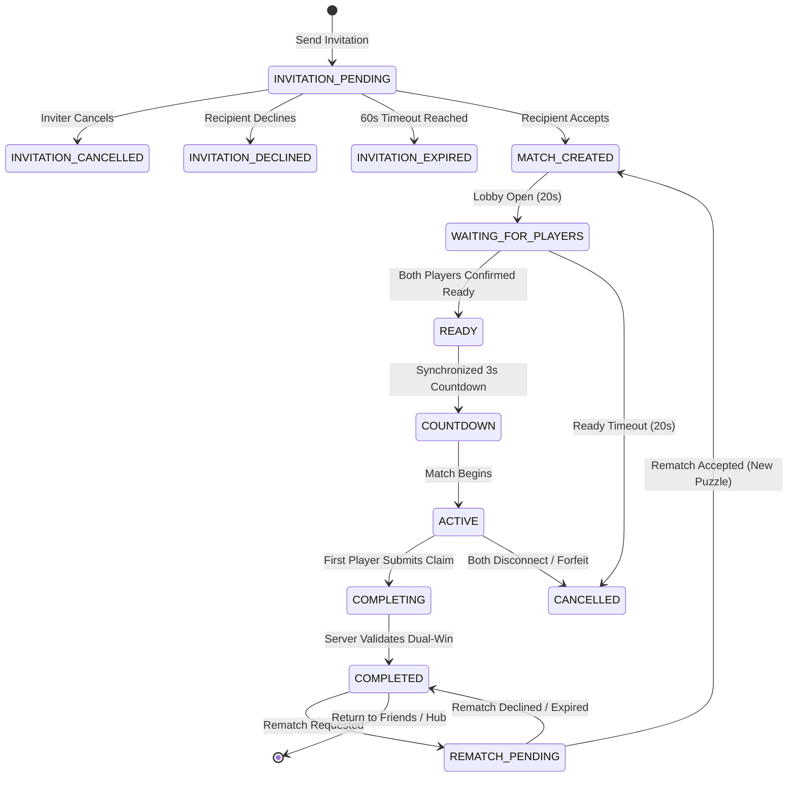

# Friend Duel 1v1 — Private Online Multiplayer Specification

## 1. Overview & Architecture

**Friend Duel** is a private, online, 1v1 competitive game mode in Zynpath: Number Path Puzzle allowing two authenticated accepted friends to compete on the exact same solver-verified continuous number path puzzle.

Friend Duel reuses the robust multiplayer foundation established in Prompt 20 & 21:
- **Session Authentication:** Token-validated player identities (no guest UUIDs or fake opponents).
- **Social Authority:** Strict server-side verification via `SocialService` that players have mutual accepted friendship and neither is blocked.
- **Invitation Lifecycle:** Finite state machine (`PENDING`, `ACCEPTED`, `DECLINED`, `CANCELLED`, `EXPIRED`, `INVALIDATED`).
- **Synchronized Readiness:** 20-second ready window and authoritative 3-second synchronized countdown.
- **Solver-Verified Shared Puzzle:** Identical grid, dimensions, checkpoints, and blocked edges assigned from the backend `MultiplayerPuzzlePool`.
- **Authoritative Validation:** Server-side dual-win validation (8 verification checks) measuring true solve time (`now - startedAt`).
- **Interactive Rematch Experience:** Seamless rematch request with alternative puzzle assignment and mutual consent.

---

## 2. Friendship & Authorization Rules

1. **Mutual Friendship Required:** An invitation can only be dispatched if `socialService.areFriends(inviterId, recipientId)` is `true`.
2. **Block Enforcement:** If either participant has blocked the other (`socialService.isBlocked(a, b)`), invitations are strictly rejected with `HTTP 403 FORBIDDEN`.
3. **Friendship Removal During Active Match:** If a player unfriends or blocks the opponent during an active match, the active match is allowed to run to natural completion. Subsequent rematch requests or future invitations will fail authorization checks.
4. **Guest Isolation:** Unauthenticated guest players are prevented from sending online invitations and prompted to sign in. Offline Solo Play and Daily Challenges remain completely unaffected.

---

## 3. Match Lifecycle & State Machine

---

## 4. Competitive Integrity & Hints Policy

- **Hints Strictly Disabled:** Solution-revealing hints are disabled during competitive matches to preserve fairness.
- **Free Undo & Reset:** Players can backtrack or reset their active path locally without penalty.
- **Coarse Progress Reporting:** Only covered cell count and completed checkpoint milestones are dispatched to the opponent via WebSocket. Individual touch coordinates are never streamed.
- **No Client-Authoritative Victory:** A local engine completion is marked provisional until the backend solver validates the submission.

---

## 5. Competitive History & Statistics Integration (Prompt 24)
- **Match Ingestion:** Every finalized Friend Duel is ingested into `CompetitiveService`.
- **Match History:** Accessible via `GET /api/v1/multiplayer/history?mode=FRIEND_DUEL`. Shows friend's public profile, match date, outcome, solve time, and rematch indicator.
- **Historical Integrity After Friendship Removal:** Historical match records remain immutable and valid even if players subsequently unfriend or block each other. Private profile data or current status is never exposed through historical records.
- **Dedicated Metrics:** Friend Duel statistics track:
  - `friendDuelMatches`: Total completed or concluded Friend Duel matches.
  - `friendDuelWins`: Total victories.
  - `friendDuelLosses`: Total defeats.
  - `friendDuelTies`: Total draws.
  - `friendDuelWinRate`: Expressed as $\text{friendDuelWins} / \text{friendDuelMatches}$.
  - Personal best solve times tagged with `FRIEND_DUEL`.
- **Verified Achievements:** Unlocks `comp_friend_duel_complete` upon completing the first verified Friend Duel match.

---

## 6. Friend Duel Notification Alerts (Prompt 31)
- **`FRIEND_DUEL_INVITATION` Alert**: When Player A sends an invitation, `FriendDuelService` dispatches a notification to Player B with inviter display name, 5-minute expiration timestamp, and deep link into `friend_duel`.
- **`FRIEND_DUEL_INVITATION_ACCEPTED` / `DECLINED`**: Sent back to the inviter when the invited friend accepts or declines.
- **Expiration Enforcement**: Tapping an expired invitation notification displays the expired state and never reopens or recreates an invalid duel.
- **Deep-Link Authorization**: Revalidates player session; unauthorized users are redirected to Sign-In.

---

## 7. Security Hardening & Abuse Prevention (Prompt 36)

- **Invitation Recipient Authorization**: Invitation handling enforces `@RequireAccess(FRIEND_RELATIONSHIP_REQUIRED)` and `ResourceAuthorizationService.verifyInvitationParticipant`. Only the explicit recipient can accept or decline; third-party accounts cannot hijack or accept invitations by guessing invitation IDs.
- **Invitation Rate Limiting & Cooldown**: Governed by `RateLimitPolicy.SOCIAL` (20 req/min per player) with a 5-second per-friend dispatch cooldown to prevent invitation flooding.
- **Full Path Verification**: Dual-win claims in Friend Duels are subject to the same rigorous 8-point `ServerPuzzleValidator` rules and server-authoritative timing as Quick Duel. Friendship never relaxes result validation standards.
- **Strict Hint Prohibition**: Enforced by `CompetitiveIntegrityGuard`. Hints remain completely disabled regardless of Premium subscription status.

---

## 8. Performance & Lifecycle Optimization (Prompt 37)
- **Lifecycle-Aware State Collection**: `FriendDuelScreen` observes UI state via `collectAsStateWithLifecycle()`, halting Flow collection when the screen is navigated away from or backgrounded.
- **WebSocket Reconnection Backoff**: Network interruptions during active duels trigger bounded exponential backoff reconnection (1s, 2s, 4s, max 8s, 3 attempts), automatically re-authenticating and subscribing back to the match session.
- **Draw-Phase Canvas Animations**: Reuses `PuzzleBoard` with draw-phase animation reads and text layout caching, keeping 60/120 FPS frame rate steady.

---

## 9. Reconnection & Disconnect Recovery (Prompt 38)
- **Authoritative State Sync on Reconnect**: When reconnecting during a Friend Duel, the client requests the latest match state via REST snapshot. If the friend has already finished or forfeited, the UI immediately displays the authoritative outcome.
- **Invitation State Durability**: Invitations are managed server-side. If the app restarts while an invitation is pending, the client re-queries active incoming and outgoing invitations; invitations are never duplicated or accepted twice.

---

## 10. Accessibility, TalkBack Semantics & Rematch Labels (Prompt 39)
- **Clear Text Rematch & Invitation Labels**: Action buttons avoid emoji-only or color-only cues, exposing explicit text ("Rematch", "Accept Challenge", "Decline Challenge") with $\ge 48\text{ dp}$ touch targets.
- **Accessible Board Navigation**: Reuses the dual-layer `PuzzleBoard` with TalkBack virtual cell grid and physical keyboard / D-pad support.
- **Fairness Guarantee**: Alternative cell selection inputs conform to the exact same `PuzzleEngine` invariants and generate identical path submissions without gameplay concessions.

## 11. Production Social Graph & Invitation Schema (Prompt 44)
- **Canonical Friend Schema (`V2__social_and_friend_relationships.sql`)**: Friends are stored with a strict check constraint (`player_id_1 < player_id_2`) preventing duplicate edge records.
- **Invitation Lifecycle & Expiry**: Invitations are stored in `multiplayer_invitations` with TTL expiry and indexed via `idx_invitations_active_lookup` (`V6`).
- **Real-Time Delivery**: In-flight friend challenge notifications and rematch states are relayed via authenticated WebSocket sessions (`/ws/multiplayer`) with server-side validation.

---

## 12. Implementation Status & Verification

- **Backend FriendDuelService:** `PASSED (100%)` (Prompt 47 backend integration test suites).
- **Backend MultiplayerController & WebSocket Handler:** `PASSED` (Prompt 47).
- **Android Repository & API Service:** `IMPLEMENTED`, `MOCK-VERIFIED`.
- **Android UI & ViewModel:** `IMPLEMENTED` (Full device validation in Prompt 48).
- **Solo & Daily Isolation:** `VERIFIED` (Independent local storage and engines).

---

## 13. Backend Friend Duel Integration & Verification (Prompt 47)

### 13.1 Test Execution Summary (`MultiplayerIntegrationTest`, `SocialControllerIntegrationTest`)
- **Verified Behaviors**:
  1. `friendDuelInvitation_lifecycle`: Tests invitation creation, friend recipient authorization, acceptance, and decline flows.
  2. `friendDuelMatchStart`: Verifies both mutual friends join the identical match session with the identical solver-verified puzzle.
  3. `friendDuelRematch`: Verifies rematch request generates an independent new match session with an alternative puzzle from the pool while preserving the previous match history.
  4. `invitationHijacking_shouldBeRejected`: Confirms non-recipients cannot accept or decline invitations addressed to other players.
  5. `blockedPlayer_shouldNotChallenge`: Blocks and privacy controls prevent blocked users from creating friend duel invitations.

### 13.2 Defect Fixed and Reverified
- **Defect**: `FriendDuelService.acceptInvitation` parameter ordering was inverted (`recipientPlayerId, invitationId` vs caller passing `invitationId, recipientPlayerId`), leading to potential parameter mismatch.
- **Resolution**: Realigned signature to `acceptInvitation(String invitationId, String recipientPlayerId)` in both service and calls, resolving defect. Reverified with 100% test pass.
- Detailed report in [`docs/MULTIPLAYER_TEST_REPORT.md`](file:///d:/Zynpath/docs/MULTIPLAYER_TEST_REPORT.md).

