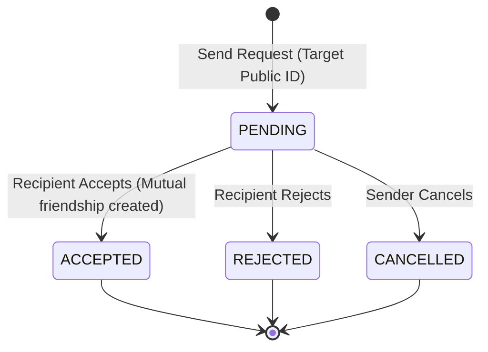

# Zynpath Friend Request Lifecycle

## Overview
This document outlines the authoritative backend and client rules governing friend request creation, resolution, cancellation, and validation.

---

## 1. Request Data Model
```java
public record FriendRequest(
    String requestId,           // UUID generated by backend
    String senderPlayerId,      // Derived from authenticated session token
    String recipientPlayerId,   // Resolved from target Public Zynpath ID
    FriendRequestStatus status, // PENDING, ACCEPTED, REJECTED, CANCELLED
    long createdAt,             // Server epoch timestamp
    long updatedAt              // Server epoch timestamp
) {}
```

---

## 2. Request Lifecycle Transitions



---

## 3. Server Authorization Safeguards
Every request operation strictly enforces backend validation:
1. **Authenticated Session Requirement:** Every call must provide a valid `Authorization: Bearer <sessionToken>` header.
2. **Sender Identity Derived from Session:** The client cannot specify or spoof the `senderPlayerId`.
3. **No Self-Requests:** If `targetPublicZynpathId` resolves to the calling player's own account, the backend rejects it with `400 Bad Request (SELF_REQUEST)`.
4. **Duplicate Prevention:** If an active pending request already exists between the two players, the backend rejects it with `409 Conflict (REQUEST_ALREADY_PENDING)`.
5. **Existing Friendship Check:** If the two players are already mutual friends, the request is rejected with `409 Conflict (ALREADY_FRIENDS)`.
6. **Block Policy:** If either player has blocked the other, the request is rejected with `403 Forbidden (PLAYER_BLOCKED)`.
7. **Recipient Ownership on Accept/Reject:** Only the designated `recipientPlayerId` can accept or reject a pending request.
8. **Sender Ownership on Cancel:** Only the original `senderPlayerId` can cancel an outgoing request.

---

## 4. Android Client Flow
- **Optimistic Refresh:** Upon receiving success from a request action, `SocialRepositoryImpl` triggers `refreshAll()` to update local reactive state flows.
- **Error Presentation:** Descriptive messages are mapped from server status codes into snackbar notifications (e.g., "Cannot send friend request to yourself", "Player not found", "Request pending").
