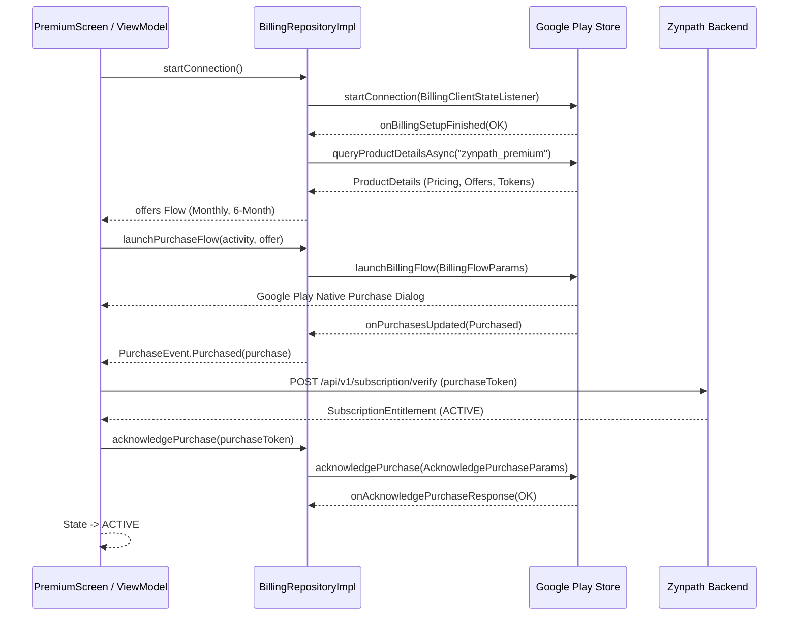

# Google Play Billing Integration Architecture

**Application:** Zynpath: Number Path Puzzle  
**Library Version:** `com.android.billingclient:billing-ktx:7.1.1`  
**Phase:** 6 — Monetization and Premium (Prompt 26/50)

---

## 1. Architecture Overview

Zynpath integrates the official Google Play Billing Library 7.x using a lifecycle-aware repository pattern. The billing client connects asynchronously, queries current `ProductDetails`, extracts localized subscription pricing, launches Google Play purchase dialogs, and coordinates acknowledgement following authoritative backend verification.



---

## 2. Product and Base Plan Identifiers

| Parameter | Configuration Value |
|---|---|
| **Product Type** | `BillingClient.ProductType.SUBS` |
| **Product ID** | `zynpath_premium` |
| **Monthly Base Plan ID** | `premium-monthly` |
| **6-Month Base Plan ID** | `premium-six-months` |

### Offer Token Resolution

In Billing Library 7.x, base plans and offers are exposed via `ProductDetails.subscriptionOfferDetails`. Zynpath inspects the `basePlanId` matching each plan and extracts the active `offerToken`:

```kotlin
val offerToken = details.subscriptionOfferDetails
    ?.find { it.basePlanId == planType.basePlanId }
    ?.offerToken
```

If Play Console configuration is missing or pending rollout, the repository honestly reports the offer as unavailable rather than fabricating a checkout price.

---

## 3. Pending Purchase Handling

In compliance with Google Play Billing requirements, pending transactions (e.g., cash payments, slow banking confirmations) are supported via:

```kotlin
billingClient = BillingClient.newBuilder(context)
    .setListener(purchasesUpdatedListener)
    .enablePendingPurchases(
        PendingPurchasesParams.newBuilder()
            .enableOneTimeProducts()
            .enablePrepaidPlans()
            .build()
    )
    .build()
```

When a purchase has state `Purchase.PurchaseState.PENDING`:
1. It is emitted as `PurchaseEvent.Pending`.
2. The UI enters state `PurchaseFlowState.PENDING`.
3. **No premium benefits are unlocked** until Google Play signals payment completion and the backend verifies the updated token.

---

## 4. Acknowledgement Policy

Under Google Play policies, subscriptions must be acknowledged within 3 days or Google Play will automatically refund the transaction.

Zynpath coordinates acknowledgement **strictly after backend verification**:
1. Google Play returns completed purchase.
2. Android submits `purchaseToken` to backend `/api/v1/subscription/verify`.
3. Backend checks with Google Play Developer API (or validates credentials).
4. Upon successful backend response, Android executes:
   ```kotlin
   billingClient.acknowledgePurchase(
       AcknowledgePurchaseParams.newBuilder()
           .setPurchaseToken(purchaseToken)
           .build()
   )
   ```
5. Repeated acknowledgement calls are idempotent.

---

## 5. Restore Purchases Flow

When the user taps "Restore Purchases":
1. Android verifies that the user is logged into an authenticated Zynpath account.
2. `BillingRepository.queryActivePurchases()` executes `queryPurchasesAsync(ProductType.SUBS)`.
3. Found tokens are sent to `POST /api/v1/subscription/restore`.
4. The backend verifies whether any token belongs to the calling account (or has never been claimed) and returns the authoritative active entitlement.
5. If no purchases exist on the Google account, an honest message is displayed.

---

## 6. Play Console Setup Prerequisites

To activate live purchases in production or internal test tracks:
1. In Google Play Console under **Monetize > Subscriptions**:
   - Create subscription product with ID `zynpath_premium`.
   - Add base plan `premium-monthly` (1 month recurring, target ₹99).
   - Add base plan `premium-six-months` (6 months recurring, target ₹499).
2. Under **API Access**:
   - Link Google Cloud Project.
   - Create a service account with `Financial data` and `Manage orders and subscriptions` permissions.
   - Export service account JSON key to backend environment `GOOGLE_PLAY_SERVICE_ACCOUNT_KEY_PATH`.
3. Configure license testers in Play Console to test subscription purchase and renewal cycles without real charges.
