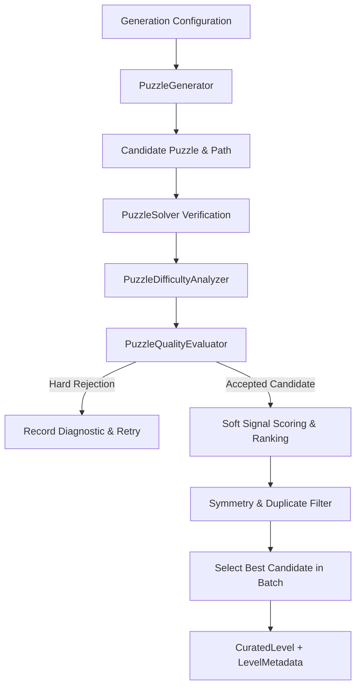

# Zynpath Level Curation & Quality Evaluation System

## Overview

The Zynpath Level Curation pipeline evaluates solver-verified candidate puzzles to ensure high gameplay quality, elegant pathing, fair difficulty progression, and complete absence of duplicates or jarring difficulty spikes.

It operates entirely offline and deterministically, producing stable `CuratedLevel` packages with rich metadata while protecting published level identities.

---

## 1. Curation Pipeline Architecture

---

## 2. Hard Rejection Rules

Any candidate violating the following rules is immediately rejected from gameplay curation:

1. **`STRUCTURAL_INVALIDITY`**: Definition fails `PuzzleDefinitionValidator` invariants (e.g. disconnected cells, negative coordinates, out-of-bounds numbers).
2. **`UNSOLVABLE`**: `PuzzleSolver` exhausts search with zero valid Hamiltonian paths found.
3. **`INCONCLUSIVE_VERIFICATION`**: Solver exceeded node/time budget before establishing uniqueness proof.
4. **`FAILED_COMPLETION_VALIDATION`**: Candidate solution fails authoritative `CompletionValidator` invariants.
5. **`GRID_DIMENSION_MISMATCH`**: Board dimensions do not match the target world configuration.
6. **`CHECKPOINT_COUNT_OUT_OF_RANGE`**: Checkpoint count falls outside the authoritative world specification.
7. **`WALL_COUNT_OUT_OF_RANGE`**: Wall count falls outside the authoritative world specification.
8. **`UNIQUENESS_NOT_PROVEN`**: Candidate has multiple solutions (`NON_UNIQUE`) or uniqueness was not proven.
9. **`EXACT_DUPLICATE`**: Canonical SHA-256 fingerprint matches an existing catalog level.
10. **`EXCESSIVE_SIMILARITY`**: Similarity score with any existing level exceeds the allowed threshold (default $0.85$).
11. **`DIFFICULTY_OUT_OF_RANGE`**: Algorithmic difficulty estimate falls outside the target progression band for that level.

---

## 3. Soft Quality Signals & Candidate Comparison

Within a candidate generation batch (typically 10–25 candidates per level), accepted candidates are ranked using multi-dimensional soft quality signals:

| Signal | Target Range | Gameplay Rationale |
|---|---|---|
| **Route Variation** | Turn frequency $0.40 \dots 0.70$ | Avoids trivial straight runs or tedious checkerboards; produces engaging, labyrinthine paths. |
| **Checkpoint Spacing** | Low gap variance ($\sigma_g^2$) | Ensures regular feedback and landmarks without long barren stretches. |
| **Choice Richness** | High branching cells ($C_{\ge 3}$) | Maximizes meaningful spatial deduction decisions for the player. |
| **Wall Relevance** | High constrained-to-wall ratio | Ensures placed walls visibly impact routes and eliminate connections, rather than serving as decorative clutter. |
| **Progression Fit** | Proximity to target score midpoint | Aligns closely with the world's continuous difficulty gradient. |

---

## 4. Symmetry & Duplicate Detection

- **Canonical Fingerprints**: Generated via `PuzzleFingerprint.computeSha256(definition)`, which is invariant to checkpoint collection ordering and wall edge direction.
- **Geometric Symmetries**: On square boards, `PuzzleSimilarityCalculator` tests all 8 symmetries of the Dihedral group $D_4$ (rotations of $0^\circ, 90^\circ, 180^\circ, 270^\circ$, and horizontal, vertical, main-diagonal, and anti-diagonal reflections).
- **Symmetric Duplicates**: If a candidate can be transformed into an already accepted level via rotation or reflection, it is rejected to ensure visual and topological variety across the catalog.

---

## 5. Authoritative World Progression Contract

| World | Levels | Grid Dimensions | Checkpoint Range | Wall Range | Target Difficulty Band | Mechanics Introduced |
|---|---|---|---|---|---|---|
| **World 1** | 1–20 | 4×4 (16 cells) | 4–6 | 0 | `BEGINNER` ($0.00 \dots 0.22$) | Core continuous path, numbered checkpoints |
| **World 2** | 21–50 | 5×5 (25 cells) | 4–7 | 0 | `EASY` ($0.18 \dots 0.38$) | Larger grid, longer connections |
| **World 3** | 51–100 | 5×5 (25 cells) | 4–7 | 1–5 | `MEDIUM` ($0.32 \dots 0.55$) | Introductory walls (Levels 51–60 capped at 1–2 walls) |
| **World 4** | 101–150 | 6×6 (36 cells) | 4–8 | 2–8 | `MEDIUM` ($0.45 \dots 0.68$) | Larger grid with multiple walls |
| **World 5** | 151–200 | 7×7 (49 cells) | 4–10 | 4–12 | `HARD` ($0.60 \dots 0.82$) | Dense grids and complex detours |
| **World 6** | 201–300 | 8×8 (64 cells) | 4–12 | 6–18 | `EXPERT` ($0.75 \dots 1.00$) | Grandmaster number-path challenges |

### Periodic Recovery Levels
Within each world, every 5th or 10th level can feature a slightly relaxed difficulty target ($\sim 6\%$ reduction) to relieve cognitive fatigue and maintain player momentum before challenging milestones.

---

## 6. Level Metadata & Progress Protection

Each curated level produces a `LevelMetadata` record:
- `levelId` & `worldId`: Deterministic catalog progression index.
- `puzzleId` & `puzzleVersion`: Stable versioned identifier (e.g. `zyn_w1_lvl1_s5000`, `1.0.0`).
- `generationSeed` & `generatorVersion`: Full mathematical provenance.
- `difficultyEstimate` & `difficultyBand`: Provisional objective rating.
- `uniquenessStatus`: Exhaustively proven `UNIQUE`.
- `curationVersion`: Curation pipeline version (`1.0.0`).

> [!IMPORTANT]
> **Complete Solution Concealment:** Ordinary user-facing `LevelMetadata` does NOT store the complete solution path. Solution paths are strictly held within internal verification pipelines to prevent player spoilers and data tampering.
