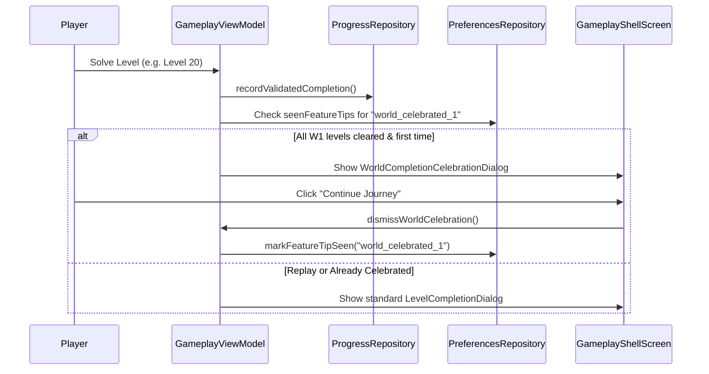

# Milestone Celebrations & Personal Best Recognition — Zynpath

## 1. Overview

Milestone celebrations in Zynpath give meaningful, joyful feedback to the player upon completing significant milestones without creating annoyance or repetitive interruptions.

---

## 2. World Completion Celebrations

### Canonical World Boundaries
Zynpath defines exactly 6 canonical worlds:
- **World 1: The Awakening** — Levels 1–20 (20 levels)
- **World 2: Binary Drift** — Levels 21–50 (30 levels)
- **World 3: Labyrinth of Walls** — Levels 51–100 (50 levels)
- **World 4: Quantum Portal** — Levels 101–150 (50 levels)
- **World 5: Temporal Flux** — Levels 151–200 (50 levels)
- **World 6: The Singularity** — Levels 201–300 (100 levels)

### First-Time Celebration & Deduplication
To prevent celebration fatigue:
1. When a player completes a level in `GameplayViewModel`, the app checks whether all levels in that world are now completed.
2. It inspects DataStore `UserPreferences.seenFeatureTips` for the key `world_celebrated_{worldId}`.
3. If this key is absent, `GameplayUiState.Ready` sets `worldCelebration = worldDef`.
4. In `GameplayShellScreen`, the `WorldCompletionCelebrationDialog` is displayed instead of the standard level completion dialog.
5. Upon tapping "Continue" or dismissing the dialog, `dismissWorldCelebration()` calls `preferencesRepository.markFeatureTipSeen("world_celebrated_{worldId}")`.
6. Subsequent completions or replays of any level in that world will never trigger the celebration dialog again.

---

## 3. Personal Best Recognition

### Integrity Rules
1. **Compatible Comparison:** Personal best time comparisons only occur against the exact same level identifier (`levelId`).
2. **Strict Improvement:** A personal best indicator (`★ NEW PERSONAL BEST! ★`) is displayed if and only if:
   - The player had a previously recorded valid time (`existingBest > 0`), and
   - The current solve time is strictly faster (`finalTimeMs < existingBest`).
3. **First-time Solves:** On the initial solve of a level, the completion time is recorded as the personal record, but marked as initial completion rather than a record break.
4. **Invalid or Cheated Times:** Times <= 0 ms or unvalidated claims are never accepted as personal bests.

---

## 4. Audio & Haptics Integration

Milestone celebrations honor user preferences established in Prompt 34:
- **Audio:** Celebrations trigger celebratory sound cues via `AudioManager` only when `soundEnabled == true`.
- **Haptics:** Celebrations pulse gentle tactile feedback via `HapticManager` only when `hapticsEnabled == true`.
- **Reduced Motion:** If system reduced motion is enabled, particle animations and scale bursts are replaced with smooth static card transitions.
