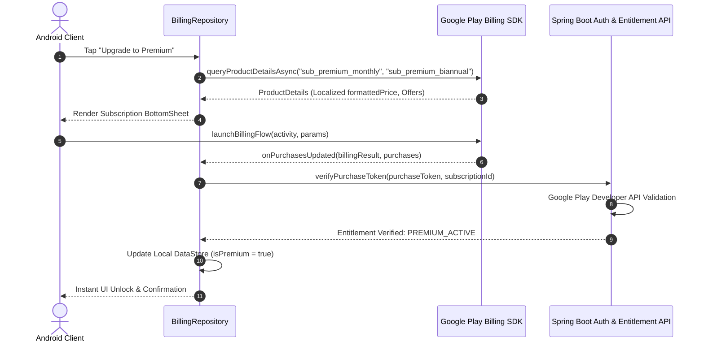

# Zynpath Monetization Architecture

**Status:** Authoritative  
**Engines:** Google AdMob & Google Play Billing SDK  

---

## 1. Monetization Philosophy & Fair Play

Zynpath is monetized with player goodwill and competitive integrity at the forefront:
- **Zero Pay-to-Win**: Premium subscribers receive cosmetic, analytical, and convenience perks. They do **not** receive competitive advantages in Duels or Leagues.
- **Fair Competitive Field**: In all multiplayer modes, hints are **strictly disabled for both Free and Premium players**.
- **Uncompromised Immersion**: **Zero advertisements are ever displayed during active puzzle solving or competitive matches.**
- **Essential Tools are Free**: Undo and Reset are 100% free and unlimited for all players.

---

## 2. Feature Matrix: Free vs. Premium

| Feature | Free Tier | Premium Tier |
|---|---|---|
| **Core Offline Campaign (Worlds 1–6)** | Unlimited (300 Levels) | Unlimited (300 Levels) |
| **Undo & Reset Actions** | **Free & Unlimited** | **Free & Unlimited** |
| **Quick Duel & Friend Duel** | Unlimited Access | Unlimited Access |
| **Mini League Tournaments** | Unlimited Access | Unlimited Access |
| **Temporary Reactions** | Full Preset Access | Full Preset Access |
| **Competitive Multiplayer Hints** | **Disabled (Fair Play)** | **Disabled (Fair Play)** |
| **Solo Mode Hints** | 3 Free per day + Rewarded Ad | **Unlimited Instant Hints** |
| **Banner & Interstitial Ads** | Present (Paced & Capped) | **100% Ad-Free Experience** |
| **Exclusive Master Level Packs** | Not Included | Full Access to Bonus Campaigns |
| **Visual Themes & Path Effects** | Default Theme | Exclusive Themes & Glowing Paths |
| **Profile Badges & Flair** | Standard Avatar | Premium Holographic Badges |
| **Advanced Solve Analytics** | Basic Summary | Deep Heatmaps, Parity & Speed Trends |

---

## 3. Premium Subscription Pricing Structure

The target pricing for Zynpath Premium is calibrated for broad accessibility:

| Subscription Tier | Proposed Pricing | Billing Period | Key Target Market |
|---|---|---|---|
| **Monthly Pass** | **₹99** / month | 30 Days Auto-Renewing | Casual & Monthly Churn |
| **Bi-Annual Pass** | **₹499** / 6 months | 180 Days Auto-Renewing | Dedicated Enthusiasts (Save ~16%) |

> **MANDATORY ENGINEERING RULE:**  
> **Never hardcode currency symbols or numeric prices in application code or UI strings.**  
> The Android application must query `BillingClient.queryProductDetailsAsync()` and format displayed prices using `ProductDetails.SubscriptionOfferDetails.pricingPhases.formattedPrice`. This guarantees localized currency formatting (e.g., `$1.49`, `€1.29`, `₹99.00`) and regional tax compliance.

---

## 4. Google AdMob Integration Specifications

### 4.1 Ad Formats & Placement Rules
1. **Banner Ads**:
   - Anchored strictly to the bottom of the **World Select** and **Level Complete** screens.
   - **Never displayed inside the puzzle solving Canvas screen.**
2. **Interstitial Ads**:
   - Paced transition ads shown only between completed levels.
   - **Pacing Rules**:
     - Minimum 4 completed levels between interstitials.
     - Minimum 180-second cooldown period between impressions.
     - Never shown if the player fails or resets a level.
     - Never shown during or immediately preceding multiplayer matches.
3. **Rewarded Video Ads**:
   - Exclusively opt-in.
   - Triggered when a free player requests a hint after exhausting their 3 free daily hints:
     `"Watch a short video to unlock 1 Hint"`
   - Completing the video grants exactly 1 hint token stored in Room.

---

## 5. Google Play Billing Architecture

