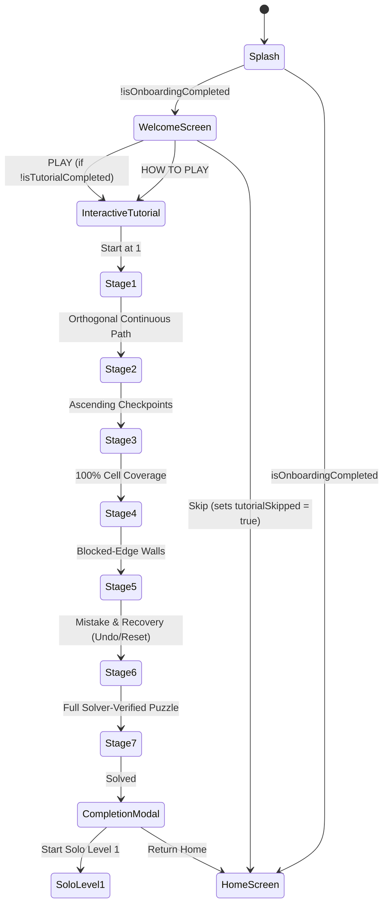

# Zynpath Player Onboarding Architecture

## 1. Onboarding Principles & Experience Design
The Zynpath player onboarding flow introduces newcomers to continuous number-path puzzles through **interactive play and direct touch** rather than static text manuals or intrusive account walls.

### Core Philosophy
1. **Teach Through Doing**: The player interacts with live puzzle boards from their very first minutes.
2. **Guest-First Entry**: No mandatory account creation, Google/Facebook sign-in, or network connection blocks first-time players. A local persistent guest identity is provisioned instantly.
3. **Zero Forced Commercials or Permissions**: No interstitial ads, rewarded ad prompts, or runtime permission requests (such as notifications or advertising IDs) interrupt onboarding.
4. **Replayability & Modularity**: The complete interactive tutorial can be skipped at launch and replayed anytime from Settings or the Home quick navigation grid without resetting Solo campaign progression.

---

## 2. First-Launch Flow State Machine

---

## 3. First-Launch Screen Specifications
- **App Title**: `Zynpath`
- **Tagline**: `One path. Every number.`
- **Hero Presentation**: Solver-verified interactive preview board showcasing the continuous number-path mechanic with authentic wall boundaries.
- **Primary Action**: `PLAY` (launches Stage 1 of the interactive tutorial if uncompleted, or jumps directly into the game if previously finished).
- **Secondary Action**: `HOW TO PLAY` (explicitly starts the interactive tutorial from Stage 1).
- **Skip Action**: `Skip` in the header bar allows experienced puzzle players to bypass onboarding directly into the main hub.

---

## 4. Guest Identity & Account Safety
- Every guest player is assigned an anonymous, stable UUID upon launch.
- Completing or skipping the tutorial sets `isOnboardingCompleted = true` and `isTutorialCompleted = true` in DataStore preferences.
- If a guest links an account (Google or Facebook) via Settings or Profile, local tutorial state and Solo puzzle progress are securely merged without wiping completed levels.
- Replaying the tutorial at any time operates strictly on sandbox tutorial boards and never resets or overwrites canonical Solo level stars or best times.
