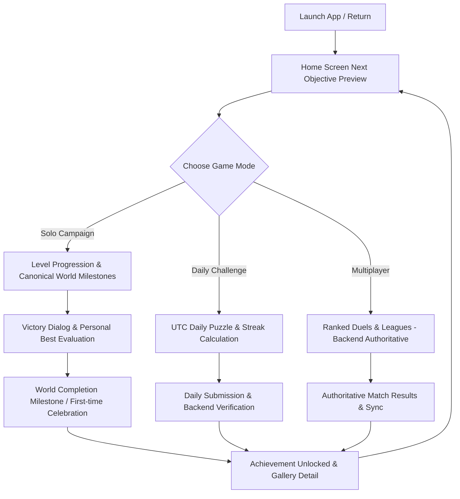

# Player Engagement Architecture — Zynpath

## 1. Overview & Engagement Philosophy

Zynpath is designed around intrinsic puzzle-solving satisfaction, intellectual discovery, and respectful retention. The engagement system rejects predatory free-to-play patterns, manipulative mechanics, and artificial friction.

### Core Engagement Principles
1. **Respectful Retention:** Players are encouraged through authentic progression, intellectual mastery, and clear personal bests. No streaks or achievements are erased or punished due to breaks.
2. **Zero Fake Urgency & Zero Scarcity:** No artificial countdown timers urging players to spend money or play immediately.
3. **No Streak Shaming:** Missing a Daily Challenge day simply resets the active streak counter without derogatory alerts, penalties, or guilt-inducing notifications.
4. **Offline First:** Local guest progression in Solo mode is authoritative and fully persistent offline. All Solo milestones unlock offline.
5. **Fairness Over Monetization:** Premium tier enhances cosmetic themes and detailed personal analytics; it never alters puzzle mechanics, board rules, hint counts, or competitive conditions.

---

## 2. Retention Loops & Player Journey

---

## 3. Returning Player Experience

When a player returns to Zynpath after any duration (hours, days, or months):
- **Immediate State Preservation:** The application resumes from their exact completed level in the canonical world catalog.
- **No Repetitive Onboarding:** Tutorial and onboarding sequences are never re-triggered once completed.
- **Next Objective Discovery:** The Home Screen prominently highlights the next actionable goal (e.g., "Next Objective: Clear Level 21 in World 2" or next unearned achievement closest to completion).
- **Graceful Daily Challenge Discovery:** Today's puzzle is ready if unplayed; prior unplayed daily puzzles do not generate overdue penalties.

---

## 4. Notification Integration & Quiet Hours

Zynpath respects system and user-defined notification preferences (established in Prompt 31):
- **Strict Opt-In:** Notifications for Daily Challenge reminders or achievement milestones require explicit user opt-in in Player Settings.
- **Quiet Hours:** Notifications are suppressed during the configured quiet hours window (default: 22:00 to 08:00 local time).
- **No Achievement Spam:** Achievement unlocking inside the app displays immediate visual and haptic feedback; push notifications are reserved for external reminders if specifically enabled.

---

## 5. Privacy-Aware Statistics & Isolation

- **Local Guest Storage:** Guest achievements and progress remain isolated on the device in Room DB until explicit account linking.
- **Account Isolation:** Multi-account transitions invalidate in-memory caches and re-evaluate database scopes to prevent cross-account milestone leakage.
- **Telemetry Safeguards:** Analytics events log high-level feature discovery (e.g., `home_resume_clicked`, `achievement_viewed`) without transmitting user touch coordinates, board paths, or private gameplay metrics.
