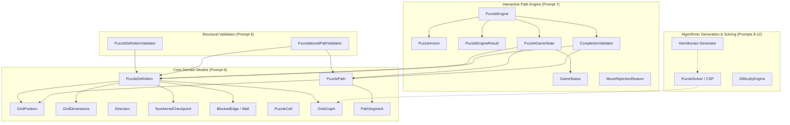

# Zynpath Continuous-Path Puzzle Engine

**Specification Status:** Authoritative & Multiplatform-Ready  
**Language:** Pure Kotlin (Standard Library Only — Zero Android Dependencies)  
**Package:** `com.zynpath.game.core.puzzle`  

---

## 1. Engine Architecture & Module Boundary

The continuous-path puzzle engine is the mathematical and logical heart of Zynpath. It is completely decoupled from Android SDK classes (`Context`, `Canvas`, `Compose`, `ViewModel`, `Room`, `DataStore`) to enable:
- Sub-millisecond JVM unit test execution without an emulator.
- Headless solution verification on the Spring Boot backend using identical domain rules and schemas.
- Future cross-platform multiplatform readiness.



---

## 2. Core Domain Data Models

### 2.1 GridCoordinate / GridPosition
- **Coordinate System**: 0-indexed Cartesian coordinate `(row, column)`.
- **Origin**: `(0, 0)` is strictly the top-left cell.
- **Properties**:
  - `row: Int`, `column: Int` (with `col` alias for backward compatibility).
  - Value equality and stable `hashCode()`.
  - Row-major `Comparable<GridPosition>`.
  - `isOrthogonalNeighbor(other: GridPosition): Boolean`: True if Manhattan distance is exactly 1.
  - `manhattanDistance(other: GridPosition): Int`: $|r_1 - r_2| + |c_1 - c_2|$.
  - `neighbor(direction: Direction): GridPosition`.
  - `orthogonalNeighbors(): List<GridPosition>`: Canonical order `[UP, RIGHT, DOWN, LEFT]`.
  - `directionTo(other: GridPosition): Direction?`.

### 2.2 GridDimensions
- **Properties**: `rows: Int`, `columns: Int`.
- **Validation**: Strict positivity (`rows > 0`, `columns > 0`) and bounded allocation limit (`MAX_DIMENSION = 50`) to prevent memory exhaustion and arithmetic overflow.
- **Support**: Full rectangular and square grid support.
- **Methods**: `contains(position)`, `totalCellCount`, `allPositions(): List<GridPosition>` in row-major order.

### 2.3 Direction (Orthogonal Only)
- **Values**: `UP (-1, 0)`, `DOWN (1, 0)`, `LEFT (0, -1)`, `RIGHT (0, 1)`.
- **No Diagonals**: Game rules strictly prohibit diagonal movement.
- **Helpers**: `opposite`, `isVertical`, `isHorizontal`.

### 2.4 NumberedCheckpoint
- **Properties**: `number: Int`, `position: GridPosition`.
- **Requirements**: `number >= 1`, unique numbers and coordinates, `isStart` for `#1`.
- **Contiguity**: Checkpoint sequence in a valid puzzle must form a gapless series $1, 2, \dots, N$.

### 2.5 BlockedEdge (Wall Representation)
- **Concept**: A wall is an obstructed boundary **between** two orthogonally adjacent cells. A wall is NOT a blocked cell.
- **Properties**: `first: GridPosition`, `second: GridPosition`.
- **Direction-Independent Equality**:
  $$\text{BlockedEdge}(A, B) == \text{BlockedEdge}(B, A)$$
- **Canonical Ordering**: The factory `BlockedEdge.between(a, b)` automatically sorts endpoints such that `first <= second`, guaranteeing identical hash codes and deduplication in `Set<BlockedEdge>`.
- **Orientation**: `isHorizontalBoundary`, `isVerticalBoundary`.

### 2.6 PuzzleCell
- Minimal domain cell holding `position: GridPosition`, `isRequired: Boolean = true`, and optional `checkpoint: NumberedCheckpoint?`.
- Completely decoupled from UI rendering colors, touch states, or Compose canvas pixels.

### 2.7 GridGraph
- Represents the puzzle topology as an unweighted planar graph where required cells are vertices and legal orthogonal transitions are edges.
- Fast constant-time queries:
  - `isInsideGrid(position: GridPosition): Boolean`
  - `isRequiredCell(position: GridPosition): Boolean`
  - `areOrthogonallyAdjacent(a: GridPosition, b: GridPosition): Boolean`
  - `isBlocked(a: GridPosition, b: GridPosition): Boolean`
  - `canTraverse(from: GridPosition, to: GridPosition): Boolean`
  - `getNeighbors(position: GridPosition): List<GridPosition>`
  - `getTraversableNeighbors(position: GridPosition): List<GridPosition>`

### 2.8 PuzzleDefinition
- Immutable level specification holding:
  - `puzzleId: String` (e.g. `"world_1_level_5"`)
  - `puzzleVersion: Int`
  - `gridDimensions: GridDimensions`
  - `requiredCells: Set<GridPosition>`
  - `checkpoints: List<NumberedCheckpoint>`
  - `blockedEdges: Set<BlockedEdge>`
  - `difficultyMetadata: String?`
  - `seed: Long?`
- Precomputes lazy `checkpointMap` and `graph: GridGraph`.

### 2.9 PuzzlePath & PathSegment
- `PuzzlePath`: Immutable ordered sequence of `List<GridPosition>`.
  - Preserves exact chronological traversal order.
  - Precomputes lazy `visitedCells: Set<GridPosition>` for $O(1)$ membership checks.
  - Detects self-intersections (`hasRevisitedCells`).
  - Immutable operations: `plus(nextPosition)`, `dropLast(count)`, `retractTo(position)`.
  - Precomputes lazy `segments: List<PathSegment>`.
- `PathSegment`: Directed connection `from -> to` with `direction: Direction?`, `isOrthogonal`, `isHorizontal`, `isVertical`.

---

## 3. Interactive Path Engine (`com.zynpath.game.core.puzzle.engine`)

Implemented in Prompt 7, the interactive engine provides deterministic state management, move-by-move rule validation, intuitive drag backtracking, and authoritative completion gating.

### 3.1 State Models & Lifecycle

#### `GameStatus`
- `NOT_STARTED`: Board loaded, awaiting touch at checkpoint 1.
- `IN_PROGRESS`: Path drawing active.
- `COMPLETED`: 100% cells covered and all checkpoints visited in order ending at #N.
- `PAUSED`: Gameplay suspended.

#### `PuzzleGameState`
Immutable snapshot holding:
- `puzzleDefinition: PuzzleDefinition`
- `currentPath: PuzzlePath`
- `nextRequiredCheckpoint: Int` (starts at 1, advances to $N+1$)
- `visitedCheckpointCount: Int`
- `coveredCellCount: Int`
- `totalRequiredCells: Int`
- `currentEndpoint: GridPosition?`
- `moveCount: Int`
- `gameStatus: GameStatus`
- `lastRejection: MoveRejectionReason?`
- `completionResult: ValidatedCompletionResult?`
- `toBoardState(): PuzzleBoardState`: Maps domain state to Compose Canvas presentation.

### 3.2 Action Model (`PuzzleAction`)
- `StartPath(position)`: Begins path at checkpoint 1. Rejects any other cell.
- `ExtendPath(position)`: Extends path forward orthogonally. If [position] is the immediate predecessor, triggers automatic 1-step undo (intuitive drag backtrack).
- `BacktrackTo(position)`: Retracts path back to an already visited cell, updating checkpoint progress.
- `BacktrackOne`: Retracts path by 1 step.
- `ResetPath`: Restores `NOT_STARTED` initial state.
- `PauseGame` / `ResumeGame`: Controls session pause state.

### 3.3 Move Rejection Reasons (`MoveRejectionReason`)
- `START_MUST_BE_CHECKPOINT_ONE`: First move must be start checkpoint #1.
- `OUT_OF_BOUNDS`: Position is outside grid boundary.
- `EXCLUDED_CELL`: Position is on a non-playable cell.
- `NON_ADJACENT`: Step is diagonal or jumps across multiple cells.
- `BLOCKED_BY_WALL`: Step crosses an edge barrier/wall.
- `CELL_ALREADY_VISITED`: Step revisits an occupied cell (cycle / self-intersection).
- `WRONG_CHECKPOINT_ORDER`: Step enters a checkpoint out of sequential order.
- `PREMATURE_FINAL_CHECKPOINT`: Player attempts to enter final checkpoint before covering all other required cells.
- `GAME_ALREADY_COMPLETED`: Forward moves frozen after victory.
- `GAME_PAUSED`: Actions blocked while paused.
- `INVALID_ACTION`: Action cannot be executed in current state.

### 3.4 Move Validation Lifecycle
```
Touch Event / Action
       │
       ▼
[Is Game Paused / Completed?] ──YES──> Reject (GAME_PAUSED / COMPLETED)
       │ NO
[Is Action StartPath?] ────────YES──> Is Checkpoint 1? ──NO──> Reject (START_MUST_BE_CHECKPOINT_ONE)
       │ NO                                            ──YES─> Accept (Set IN_PROGRESS, nextCp = 2)
[Is Position Predecessor?] ────YES──> Backtrack 1 step (Drag Undo)
       │ NO
[In Grid Bounds & Required?] ──NO───> Reject (OUT_OF_BOUNDS / EXCLUDED_CELL)
       │ YES
[Orthogonally Adjacent?] ──────NO───> Reject (NON_ADJACENT)
       │ YES
[Crosses BlockedEdge/Wall?] ───YES──> Reject (BLOCKED_BY_WALL)
       │ NO
[Already Visited?] ────────────YES──> Reject (CELL_ALREADY_VISITED)
       │ NO
[Contains Checkpoint?]
  ├── NO ──> Accept Forward Step
  └── YES ─> [Is Final Checkpoint?]
               ├── YES ─> [100% Other Cells Covered?]
               │            ├── NO ──> Reject (PREMATURE_FINAL_CHECKPOINT)
               │            └── YES ─> Accept & Run CompletionValidator ──> COMPLETED
               └── NO  ─> [Is Next Required Checkpoint?]
                            ├── NO ──> Reject (WRONG_CHECKPOINT_ORDER)
                            └── YES ─> Accept (Advance nextCp)
```

---

## 4. Completion Validation & Dual Win Enforcement (`CompletionValidator`)

Independent authoritative validator verifying all 8 non-negotiable rules:
1. Path starts at checkpoint 1.
2. Every consecutive pair is orthogonally adjacent (no diagonals).
3. No segment crosses a wall (`BlockedEdge`).
4. No required cell is visited more than once (simple path).
5. 100% of required cells are covered (`coveredCellCount == totalRequiredCells`).
6. All checkpoints appear in strictly ascending order $1 \dots N$.
7. The final path position is the highest-numbered checkpoint ($N$).
8. No excluded or out-of-bounds cells are visited.

**Dual Win Enforcement**:
- All checkpoints visited with uncovered cells: **NOT VICTORY** (`Failure(INCOMPLETE_CELL_COVERAGE)`).
- All cells covered in wrong checkpoint order: **NOT VICTORY** (`Failure(WRONG_CHECKPOINT_ORDER)`).
- Reaching final checkpoint prematurely: **REJECTED** (`PREMATURE_FINAL_CHECKPOINT`).
- Produces a valid, immutable `ValidatedCompletionResult` only when all 8 criteria strictly hold.

---

## 5. Language-Neutral JSON Puzzle Schema for Backend Validation

To allow independent server-side verification in Spring Boot without code duplication, the puzzle contract is defined in standard JSON:

```json
{
  "$schema": "https://json-schema.org/draft/2020-12/schema",
  "title": "PuzzleDefinition",
  "type": "object",
  "required": ["puzzleId", "puzzleVersion", "gridDimensions", "requiredCells", "checkpoints", "blockedEdges"],
  "properties": {
    "puzzleId": { "type": "string" },
    "puzzleVersion": { "type": "integer", "minimum": 1 },
    "gridDimensions": {
      "type": "object",
      "required": ["rows", "columns"],
      "properties": {
        "rows": { "type": "integer", "minimum": 1, "maximum": 50 },
        "columns": { "type": "integer", "minimum": 1, "maximum": 50 }
      }
    },
    "requiredCells": {
      "type": "array",
      "items": {
        "type": "object",
        "required": ["row", "column"],
        "properties": {
          "row": { "type": "integer", "minimum": 0 },
          "column": { "type": "integer", "minimum": 0 }
        }
      }
    },
    "checkpoints": {
      "type": "array",
      "minItems": 2,
      "items": {
        "type": "object",
        "required": ["number", "position"],
        "properties": {
          "number": { "type": "integer", "minimum": 1 },
          "position": {
            "type": "object",
            "required": ["row", "column"],
            "properties": {
              "row": { "type": "integer", "minimum": 0 },
              "column": { "type": "integer", "minimum": 0 }
            }
          }
        }
      }
    },
    "blockedEdges": {
      "type": "array",
      "items": {
        "type": "object",
        "required": ["first", "second"],
        "properties": {
          "first": {
            "type": "object",
            "required": ["row", "column"],
            "properties": {
              "row": { "type": "integer", "minimum": 0 },
              "column": { "type": "integer", "minimum": 0 }
            }
          },
          "second": {
            "type": "object",
            "required": ["row", "column"],
            "properties": {
              "row": { "type": "integer", "minimum": 0 },
              "column": { "type": "integer", "minimum": 0 }
            }
          }
        }
      }
    }
  }
}
```

---

## 6. Deterministic Test Fixtures (`SamplePuzzleFixtures`)

1. **`puzzle4x4Valid`**: 4×4 board, checkpoints #1 at (0,0), #2 at (1,3), #3 at (2,0), #4 at (3,0).
   - Solution: 16-step serpentine Hamiltonian path (`solution4x4Route`).
2. **`puzzle5x5Valid`**: 5×5 board, checkpoints #1 at (0,0), #2 at (1,4), #3 at (2,0), #4 at (3,4), #5 at (4,4).
   - Solution: 25-step serpentine Hamiltonian path (`solution5x5Route`).
3. **`puzzle5x5WithWalls`**: 5×5 board with 3 legal blocked edges:
   - Wall 1: `(0,1) | (1,1)`
   - Wall 2: `(0,3) | (1,3)`
   - Wall 3: `(2,1) | (3,1)`
   - Verified solution: `solution5x5Route` navigates around all 3 walls.
4. **Invalid Fixtures**:
   - `createDuplicateCheckpointNumberFixture()`
   - `createDuplicateCheckpointPositionFixture()`
   - `createMissingStartCheckpointFixture()`
   - `createNonContiguousCheckpointsFixture()`
   - `createOutOfBoundsCheckpointFixture()`
   - `createNonAdjacentWallFixture()`
   - `createOutOfBoundsWallFixture()`
5. **Solver & Benchmark Fixtures**:
   - `puzzle3x3Unique`: Exactly 1 verified solution.
   - `puzzle3x3MultipleSolutions`: At least 2 distinct verified solutions.
   - `puzzle4x4UnsolvableParity`: Bipartite checkerboard parity contradiction.
   - `puzzle4x4UnsolvableWalls`: Isolated cell with 0 traversable neighbors.
   - `puzzle6x6Valid`, `puzzle7x7Valid`, `puzzle8x8Valid`: Serpentine Hamiltonian benchmark fixtures.

---

## 7. Puzzle Solver & Solution Validation (`com.zynpath.game.core.puzzle.solver`)

Implemented in Prompt 8, the solver provides deterministic Hamiltonian path discovery and uniqueness checking.

### 7.1 Architecture & Core Components
- **`PuzzleSolver`**: Core depth-first search engine with Warnsdorff's heuristic, checkpoint proximity candidate ordering, and `solveAsync` coroutine support.
- **`SolverConfiguration`**: Immutable execution controls (`maxSolutions`, `nodeLimit`, `timeBudgetMs`, `enablePruning`, `cancellationSignal`).
- **`SolverResult`**: Structured outcome with `status`, `solutions`, `isExhaustive`, `isSolved`, `isUnique`, `uniqueness`, and `statistics`.
- **`SolverStatus`**: `SOLVED`, `UNSOLVABLE`, `MULTIPLE_SOLUTIONS`, `SEARCH_LIMIT_REACHED`, `CANCELLED`, `INVALID_PUZZLE`.
- **`UniquenessStatus`**: `UNIQUE`, `NON_UNIQUE`, `UNSOLVABLE`, `UNKNOWN`.
- **`SolverSearchState`**: Reversible search state utilizing flat boolean bitmasks and $O(1)$ generation tokens for BFS flood-fill scratch arrays.
- **`SolverPruningRules`**: 5 conservative mathematical pruning rules:
  1. Premature Final Checkpoint Entry.
  2. Checkpoint Sequence Order Compliance.
  3. Unvisited Cell Connectivity Flood-Fill (treating final checkpoint as a barrier).
  4. Intermediate Cell Degree Check ($\ge 2$ for intermediate, $\ge 1$ for final).
  5. Checkpoint Reachability Pruning (cannot traverse checkpoints $> K$ on the way to checkpoint $K$).
- **`SolutionValidator`**: Authoritative validation gate ensuring every candidate passes `CompletionValidator` and detecting engine defects.

---

## 8. Solver-Validated Puzzle Generator (`com.zynpath.game.core.puzzle.generator`)

Implemented in Prompt 9, the generator pipeline creates reproducible, structurally sound, solver-verified number-path puzzles. See `docs/PUZZLE_GENERATOR.md` for full documentation.

### 8.1 Key Capabilities & Workflow
1. **Solution-First Construction**: Generates a valid full-coverage Hamiltonian route using `RouteConstructor` (Warnsdorff random walk, serpentine, zigzag, spiral).
2. **Deterministic Checkpoint Placement**: Assigns checkpoint 1 at origin, N at terminus, and intermediate checkpoints at strictly ascending traversal indices using `CheckpointPlacementStrategy`.
3. **Route-Protected Wall Placement**: Generates direction-independent `BlockedEdge` walls exclusively on non-path orthogonal edges within `[minWalls..maxWalls]` using `WallPlacementStrategy`.
4. **Structural Candidate Verification**: Confirms grid dimensions, checkpoint counts, and wall boundaries using `CandidateValidator` and `PuzzleDefinitionValidator`.
5. **Exact Solver Verification**: Runs `PuzzleSolver` to prove solvability and verify uniqueness when configured.
6. **Authoritative Victory Validation**: Passes the solver-returned route to `CompletionValidator` to independently enforce all 8 gameplay rules.
7. **Canonical Fingerprinting**: Computes normalized string signatures and SHA-256 hashes via `PuzzleFingerprint` for duplicate detection across level packs.

---

## 9. Puzzle Difficulty Analysis & Level Curation (`com.zynpath.game.core.puzzle.curation`)

Implemented in Prompt 10, the difficulty and curation system evaluates solver-validated puzzles and selects high-quality candidates into balanced level progressions. See `docs/PUZZLE_DIFFICULTY.md` and `docs/LEVEL_CURATION.md` for complete documentation.

### 9.1 Key Capabilities & Workflow
1. **Objective Structural & Graph Metrics**: Measures rows, columns, required cells, wall density, traversable edges, average degree, branch cells ($C_{\ge 3}$), and dead-ends.
2. **Checkpoint & Route Complexity**: Computes checkpoint gaps, gap variance, max unnumbered stretch ratio, route turns, turn frequency, and straight segments along verified paths.
3. **Solver Search Telemetry**: Integrates explored nodes, backtracks, pruned branches, and formal uniqueness proofs (`UNIQUE`, `NON_UNIQUE`, `UNSOLVABLE`, `UNKNOWN`).
4. **Weighted Difficulty Scoring**: Computes normalized score $[0.0, 1.0]$ mapped to `DifficultyBand` (`BEGINNER`, `EASY`, `MEDIUM`, `HARD`, `EXPERT`) with explicit provisional algorithmic labels.
5. **Quality Evaluation & Hard Rejections**: Separates mathematical solvability from progression quality; rejects candidates violating world bounds, duplicates, or excessive similarity.
6. **Symmetry & Duplicate Detection**: Supports Dihedral $D_4$ square symmetry and rectangular transformations to prevent rotated/reflected duplicates.
7. **Deterministic Level Curation**: Coordinates candidate generation, verification, scoring, and level selection with smooth progression curves and periodic recovery levels.

---

## 10. Verified Offline Level Catalog & Packaging (`com.zynpath.game.core.puzzle.catalog`)

Implemented in Prompt 11, the offline level catalog connects curated, solver-verified puzzles to stable level identities and world progression without depending on network access or runtime procedural generation. See `docs/LEVEL_CATALOG.md` for full specification.

### 10.1 Key Capabilities & Workflow
1. **Immutable World & Level Models**: `WorldDefinition` defines authoritative bounds for Worlds 1–6 (300 planned levels) with pure domain models free from Compose/Android dependencies. `LevelDefinition` assigns stable identities (`levelId`, `worldId`, `puzzleId`, `puzzleVersion`).
2. **Deterministic Asset Format & Manifest**: Standalone JSON puzzle assets (`PuzzleAssetSerializer`) and `CatalogManifest` providing versioned metadata, difficulty tags, and SHA-256 fingerprints.
3. **10-Step Admission Pipeline (`CatalogAdmissionPipeline`)**: Enforces structural validity, exact solver execution, completion validation, world bound conformance, uniqueness policy, SHA-256 fingerprint matching, and round-trip serialization before admitting any puzzle to published assets.
4. **Offline Packaging & Integrity Checks**: Puzzles packaged under `assets/puzzles/` loaded via `AndroidAssetLoader` with zero network dependency. `CatalogIntegrityChecker` verifies world contiguity, asset availability, and fingerprint integrity.
5. **Progression Integration**: `LevelCatalogRepository` observes level availability (`LOCKED`, `UNLOCKED_AND_AVAILABLE`, `COMPLETED`, `ASSET_UNAVAILABLE`, `ASSET_INVALID`) and integrates with Room `ProgressRepository` to safeguard guest progress.

---

## 11. Interactive Gameplay Integration & Touch Drawing (`com.zynpath.game.core.puzzle.ui`)

Implemented in Prompt 12, the interactive gameplay layer connects the pure engine, verified level catalog, and local progress repository to a responsive native Jetpack Compose screen. See `docs/GAMEPLAY_UI.md` and `docs/TOUCH_INPUT.md`.

### 11.1 Key Capabilities & Workflow
1. **Pure Engine Authority**: `PuzzleEngine` evaluates every cell transition (`StartPath`, `ExtendPath`, `BacktrackTo`, `BacktrackOne`, `ResetPath`). The UI observes immutable state and never independently mutates path segments.
2. **Deterministic Geometry**: `GridCoordinateMapper` maps Canvas pixel coordinates to discrete `GridPosition(row, col)` with identical cell bounds and centers used for both input detection and canvas drawing.
3. **Continuous Touch Drawing & Drag Backtracking**: `puzzleTouchInput` handles touch down at checkpoint 1, adjacent dragging, predecessor cell drag-retraction, multi-cell prefix truncation, and clean release.
4. **Fast Finger Interpolation**: Straight-line row/column leaps are resolved sequentially through the engine, stopping at the first rejected transition. Diagonal jumps safely return null to prevent illegal shortcuts.
5. **Real-Time Canvas Rendering**: Draws cell boundaries, covered cell highlights, glowing cyan path segments, distinct checkpoint styles (Start #1, Next Required, Final #N, Visited), and blocked edge walls.
6. **Idempotent Completion**: Validated victory events trigger a single idempotent Room write in `ProgressRepository` via `GameplayViewModel`.

---

## 12. Solution-Aware Gameplay Hint Engine (`com.zynpath.game.core.puzzle.hint`)

Implemented in Prompt 14, the hint engine provides offline, mathematically validated guidance extending the player's actual continuous path prefix. See `docs/HINT_ENGINE.md` and `docs/HINT_USAGE_POLICY.md`.

### 12.1 Key Capabilities & Workflow
1. **Partial-Path Solver Integration**: `PuzzleSolver.solveFromPartialPath` initializes search states with the player's visited cells and endpoint, searching forward for a complete Hamiltonian continuation.
2. **Current-Path Compatibility**: Respects player branching; if the player takes an alternate valid route on a multi-solution puzzle, the hint system extends that route rather than forcing the generator's original path.
3. **Exhaustive Dead-End Detection**: When exhaustive search proves 0 continuations from the current path, the engine triggers `RECOVERY_REQUIRED`.
4. **Solver-Validated Recovery Guidance**: Evaluates earlier prefixes backwards to identify the longest prefix with a proven complete solution, returning rollback position and retract step count.
5. **Competitive Fairness**: Solution hints are disabled in competitive modes (Quick Duel, Friend Duel, Mini League).
6. **In-Process LRU Solution Cache**: Bounded LRU cache speeds up consecutive hints along compatible solution prefixes.


