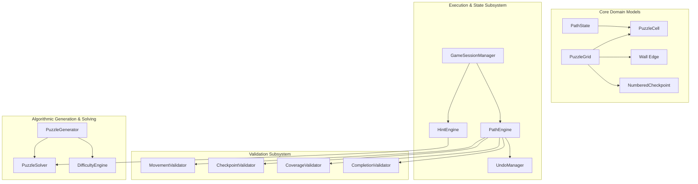

# Zynpath Continuous-Path Puzzle Engine

**Specification Status:** Authoritative & Multiplatform-Ready  
**Language:** Pure Kotlin (Standard Library Only — Zero Android Dependencies)  
**Target Module:** `core/domain`  

---

## 1. Engine Architecture & Module Boundary

The continuous-path puzzle engine is the mathematical and logical heart of Zynpath. It is intentionally decoupled from Android SDK classes (`Context`, `Canvas`, `Compose`, `ViewModel`) to allow:
- Sub-millisecond unit test execution on JVM.
- Headless solution verification on the Spring Boot backend using the exact same domain model.
- Instantaneous backtracking and deterministic puzzle generation.



---

## 2. Core Domain Data Models

```kotlin
data class Coordinate(val row: Int, val col: Int) {
    fun isAdjacent(other: Coordinate): Boolean {
        val dr = kotlin.math.abs(row - other.row)
        val dc = kotlin.math.abs(col - other.col)
        return (dr == 1 && dc == 0) || (dr == 0 && dc == 1)
    }
}

enum class Direction { NORTH, SOUTH, EAST, WEST }

data class Wall(val cellA: Coordinate, val cellB: Coordinate) {
    init {
        require(cellA.isAdjacent(cellB)) { "Wall must separate orthogonally adjacent cells" }
    }
    fun blocks(from: Coordinate, to: Coordinate): Boolean =
        (from == cellA && to == cellB) || (from == cellB && to == cellA)
}

data class NumberedCheckpoint(
    val number: Int,
    val coordinate: Coordinate
)

data class PuzzleGrid(
    val rows: Int,
    val cols: Int,
    val checkpoints: List<NumberedCheckpoint>,
    val walls: Set<Wall> = emptySet(),
    val voidCells: Set<Coordinate> = emptySet()
) {
    val totalRequiredCells: Int = (rows * cols) - voidCells.size
    val checkpointMap: Map<Coordinate, Int> = checkpoints.associate { it.coordinate to it.number }
    val maxCheckpointNumber: Int = checkpoints.maxOfOrNull { it.number } ?: 0
}
```

---

## 3. Validation Subsystem

### 3.1 MovementValidator
Evaluates individual step transitions from `currentHead` to `targetCell`:
- `TargetWithinBounds`: Target coordinate is within grid rows/cols and not in `voidCells`.
- `OrthogonalAdjacency`: Target must differ by exactly 1 in either row or col, never both.
- `NotAlreadyVisited`: Target cannot already be in the active path (prevents self-intersection).
- `NoWallCrossing`: No edge wall exists between `currentHead` and `targetCell`.

### 3.2 CheckpointValidator
Enforces strictly sequential checkpoint gating:
- If `targetCell` contains a checkpoint with value $K$:
  - $K$ must equal $\text{lastCheckpointVisited} + 1$.
  - If $K > \text{lastCheckpointVisited} + 1$, the move is **rejected** (skipped checkpoint).
  - If $K \le \text{lastCheckpointVisited}$, the move is invalid (violates no-revisit rule).

### 3.3 CoverageValidator
Computes the exact coverage fraction:
$$\text{Coverage Ratio} = \frac{\text{Path Length}}{\text{Total Required Cells}}$$
Returns `true` if and only if $\text{Path Length} == \text{Total Required Cells}$.

### 3.4 CompletionValidator
Dispatches a definitive `CompletionStatus`:
- `INCOMPLETE`: Path is in progress; valid moves remain.
- `VICTORY`: All checkpoints visited in sequence **AND** coverage is 100%.
- `DEAD_END`: No legal orthogonal moves exist from current head, but coverage < 100%.

---

## 4. Algorithmic Puzzle Generation Pipeline

Puzzles are synthesized through a multi-stage deterministic pipeline:

```
[1. Select Dimensions & Seed]
              │
              ▼
[2. Generate Hamiltonian Path (Warnsdorff / Randomized DFS)]
              │
              ▼
[3. Place Sequential Checkpoints (Spaced along Path)]
              │
              ▼
[4. Introduce Strategic Interior Walls]
              │
              ▼
[5. Run PuzzleSolver (Backtracking / Constraint Propagation)]
              │
              ▼
   IS UNIQUE & SOLVABLE?
   ├── YES ──> [6. Calculate Difficulty Metric] ──> [7. Package Level]
   └── NO  ──> [Discards and Retries with new Seed]
```

### 4.1 Step 2: Full-Board Hamiltonian Path Generation
Uses a randomized Hamiltonian path algorithm with degree-constrained branch evaluation. The path guarantees that a single contiguous path traversing all non-void cells exists.

### 4.2 Step 3: Checkpoint Placement
Places checkpoint `1` at the path origin, checkpoint $N$ at the terminal cell, and strategically distributes checkpoints $2 \dots N-1$ along the path nodes at intervals determined by target world difficulty.

### 4.3 Step 4: Wall Generation
Places candidate walls on edges that are **not traversed by the solution path**. This creates misleading visual bifurcations without obstructing the ground-truth solution.

### 4.4 Step 5: Uniqueness Validation via Solver
The `PuzzleSolver` uses depth-first constraint-satisfaction search (CSP). It attempts to find all legal full-coverage paths satisfying the checkpoints and walls:
- If `solutions.size == 1`: The puzzle is provably unique and accepted.
- If `solutions.size > 1`: The generator adds an anchor wall or extra checkpoint, or rejects the candidate.

---

## 5. Hint & Undo Subsystems

### 5.1 UndoManager
- Maintains an immutable history of coordinates in a high-efficiency stack (`ArrayDeque<Coordinate>`).
- Supports $O(1)$ push on forward move and $O(1)$ pop on backward drag or undo button.
- Retains visited checkpoint timestamps to instantly rollback checkpoint state on undo.

### 5.2 HintEngine
- Compares the player's current path prefix against the ground-truth solution:
  - **On Correct Path**: Highlights the next 1–3 cells of the solution path as animated directional pulses.
  - **Deviated / Dead-End**: Identifies the exact fork point where the player branched off the valid solution, alerting the player to backtrack to that specific cell.
- In competitive multiplayer (Duels & Leagues), `HintEngine` is disabled by contract.
