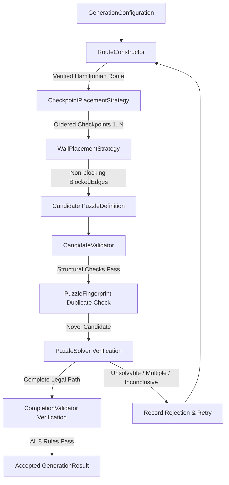

# Zynpath Solver-Validated Puzzle Generator

**Specification Status:** Authoritative & Multiplatform-Ready  
**Language:** Pure Kotlin (Standard Library Only — Zero Android Dependencies)  
**Package:** `com.zynpath.game.core.puzzle.generator`  

---

## 1. Executive Summary & Generator Objective

The Zynpath puzzle generator creates structurally valid, solvable, reproducible number-path puzzles. It employs a **solution-first** generation pipeline:
1. It never generates arbitrary numbered grids or assumes a candidate is playable without mathematical verification.
2. Every candidate is constructed around a verified full-coverage Hamiltonian route.
3. Numbered checkpoints are placed strictly along that route in ascending order.
4. Blocked edges (walls) are generated only on non-path orthogonal edges, guaranteeing the intended route remains unblocked.
5. Every candidate puzzle must pass independent structural validation (`PuzzleDefinitionValidator`).
6. Every candidate puzzle must be solved and verified by the authoritative depth-first search solver (`PuzzleSolver`).
7. Every accepted solution is checked against the 8 non-negotiable gameplay victory rules by `CompletionValidator`.
8. Uniqueness is proven through exhaustive search when required.

---

## 2. Component Architecture

The generator architecture consists of dedicated, decoupled, single-responsibility components in `com.zynpath.game.core.puzzle.generator`:

| Component | Responsibility |
|---|---|
| `PuzzleGenerator` | Central pipeline orchestrator with synchronous (`generate`) and coroutine-safe asynchronous (`generateAsync`) execution. |
| `GenerationConfiguration` | Immutable input parameters, world presets, constraint validation, seed, and solver budgets. |
| `GenerationResult` | Structured result holding accepted `PuzzleDefinition`, verified `PuzzlePath`, statistics, and diagnostic messaging. |
| `GenerationStatus` | Authoritative outcome enum (`GENERATED`, `INVALID_CONFIGURATION`, `NO_VALID_CANDIDATE`, `SOLVER_INCONCLUSIVE`, `CANCELLED`, `RESOURCE_LIMIT_REACHED`, `INTERNAL_ERROR`). |
| `RouteConstructor` | Solution-first Hamiltonian path generator supporting Warnsdorff self-avoiding random walk, serpentine, zigzag, and spiral layouts. |
| `CheckpointPlacementStrategy` | Places checkpoint #1 at origin, #N at terminus, and intermediate checkpoints at strictly ascending traversal indices with spacing heuristics. |
| `WallPlacementStrategy` | Identifies orthogonal internal edges not traversed by the route and places direction-independent `BlockedEdge` instances within `[minWalls..maxWalls]`. |
| `CandidateValidator` | Runs `PuzzleDefinitionValidator` and verifies exact checkpoint and wall count conformance. |
| `PuzzleFingerprint` | Computes canonical string representations and SHA-256 hashes for order-independent duplicate detection. |
| `GenerationStatistics` | Telemetry capturing attempts, accepted/rejected counts, solver nodes explored, elapsed times, and route turns. |

---

## 3. World Progression Contract

The generator strictly adheres to the world progression parameters established in Section 8:

| World | Levels | Dimensions | Checkpoints | Walls | Route Style |
|---|---|---|---|---|---|
| 1 | 1–20 | 4×4 | 4–6 | 0 | Serpentine / Mixed |
| 2 | 21–50 | 5×5 | 4–7 | 0 | Serpentine / Mixed |
| 3 | 51–100 | 5×5 | 4–7 | 1–5 | Mixed with Walls |
| 4 | 101–150 | 6×6 | 4–8 | 2–8 | Mixed with Walls |
| 5 | 151–200 | 7×7 | 4–10 | 4–12 | Mixed with Walls |
| 6 | 201–300 | 8×8 | 4–12 | 6–18 | Mixed with Walls |

The `GenerationConfiguration.forWorld(worldId, levelId, seed)` factory automatically configures these ranges, smoothly interpolating checkpoints and wall counts across levels.

---

## 4. Route Construction & Variations

### 4.1 Solution-First Strategy
The generator first creates a complete legal route covering 100% of required cells before generating any puzzle constraints.
Every route must satisfy:
- Exact coverage of all required cells.
- Zero revisited cells.
- Orthogonal adjacency between all consecutive cells.
- Distinct start and end positions.

### 4.2 Route Styles
- **`SERPENTINE`**: Alternating orthogonal sweeps across rows or columns with 4 orientation permutations (top-down, bottom-up, left-to-right, right-to-left). Mathematically guaranteed to succeed on any rectangular grid.
- **`ZIGZAG`**: High turn-frequency alternating traversal.
- **`SPIRAL_LIKE`**: Concentric inward perimeter traversal where topology permits.
- **`RANDOM_WALK` / `MIXED`**: Warnsdorff's minimum-onward-degree heuristic self-avoiding random walk with deterministic seeded branch exploration. Backtracks up to 4,000 nodes, falling back to seeded serpentine if dead-ends persist.

---

## 5. Checkpoint Placement & Spacing

Checkpoints are placed strictly along the verified route:
1. **Checkpoint #1**: Exactly at `route[0]`.
2. **Checkpoint #N**: Exactly at `route[route.size - 1]`.
3. **Intermediate Checkpoints**: Distributed across the route indices using a segmented spacing algorithm:
   - Partitions the route into $(N - 1)$ segments.
   - Places intermediate checkpoints at strictly ascending indices: $0 < idx_2 < idx_3 < \dots < idx_N$.
   - Applies deterministic seeded jitter within each segment to create varied unnumbered path lengths.
   - Enforces contiguous numbering $1, 2, \dots, N$.

---

## 6. Wall Placement & Route Protection

Walls are direction-independent `BlockedEdge` instances representing barriers between adjacent cells:
- **Strict Invariant**: No wall can ever be placed across any consecutive pair $(route[i], route[i+1])$ in the intended solution route.
- Candidate wall pool = All adjacent pairs of required cells **minus** all edges used by the route.
- If the available non-path edge count is less than `minWalls`, the candidate is rejected.
- Deterministic seeded selection picks target wall count from the candidate pool within `[minWalls..maxWalls]`.

---

## 7. Solver Verification & Uniqueness Policy

Every candidate puzzle is submitted to `PuzzleSolver`:
- **Solvability Proof**: The solver must find at least one complete full-coverage path.
- **Uniqueness Proof**:
  - When `requireUniqueness == true`: The solver searches for up to 2 solutions (`maxSolutions = 2`). If 2 solutions exist, the candidate is rejected (`MULTIPLE_SOLUTIONS`). The puzzle is accepted only when exhaustive search proves exactly 1 solution (`isUnique == true`).
  - When `requireUniqueness == false`: The solver searches for 1 solution (`maxSolutions = 1`). The puzzle is accepted with `UniquenessStatus.UNKNOWN` unless search was exhaustive.
- **Independent Victory Validation**: The path returned by the solver is passed to `CompletionValidator.validate()`. The puzzle is accepted only if `CompletionValidator` issues a `CompletionCheckResult.Success`.

---

## 8. Seed Reproducibility & Duplicate Detection

### 8.1 Seed Reproducibility
The generator uses a deterministic seeded `java.util.Random(config.seed)` for all randomized decisions:
- The exact same configuration and seed will always produce the identical route, checkpoint placements, walls, and solution across runs under generator version `1.0.0`.

### 8.2 Puzzle Fingerprints
`PuzzleFingerprint` normalizes and serializes puzzle topology into a canonical format:
`DIM:{rows}x{cols}|CELLS:{sorted_cells}|CP:{sorted_checkpoints}|WALLS:{sorted_canonical_walls}`
- Wall ordering and checkpoint list ordering do not alter the fingerprint.
- Duplicate detection matches canonical representations or SHA-256 hashes against a registry of previously seen puzzles, rejecting duplicates during level pack generation.

---

## 9. Failure Handling & Generation Limits

The generator rejects invalid requests and halts bounded searches:
- **`INVALID_CONFIGURATION`**: Fails immediately on invalid dimensions ($<2\times 2$), checkpoints ($<2$ or $> cells$), or impossible wall counts.
- **`NO_VALID_CANDIDATE`**: Reached `maxCandidateAttempts` without finding an accepted candidate.
- **`RESOURCE_LIMIT_REACHED`**: Generation exceeded time budget or solver node budget.
- **`CANCELLED`**: Cancelled cooperatively via cancellation predicate or coroutine cancellation.

---

## 10. Actual Benchmark Measurements

Measured on standard JVM test environment (`testDebugUnitTest` - `PuzzleGeneratorBenchmarkTest`) with `RouteStyle.SERPENTINE` across Worlds 1–6:

| Board | World | Checkpoints | Walls | Attempts | Solver Nodes | Elapsed Time | Uniqueness Status |
|---|---|---|---|---|---|---|---|
| 4×4 | World 1 | 4 | 0 | 1 | 16 | 134 ms (JIT warm-up) | UNKNOWN (maxSolutions=1) |
| 5×5 | World 2 | 5 | 0 | 1 | 56 | 12 ms | UNKNOWN (maxSolutions=1) |
| 5×5 | World 3 | 5 | 2–4 | 1 | 25 | 15 ms | UNKNOWN (maxSolutions=1) |
| 6×6 | World 4 | 6 | 2–6 | 1 | 169 | 17 ms | UNKNOWN (maxSolutions=1) |
| 7×7 | World 5 | 7 | 4–8 | 1 | 263 | 34 ms | UNKNOWN (maxSolutions=1) |
| 8×8 | World 6 | 8 | 6–12 | 1 | 67 | 8 ms | UNKNOWN (maxSolutions=1) |

---

## 11. Known Limitations & Next Steps

1. **Difficulty Calibration & Curation Pipeline**: Implemented in Prompt 10 via `PuzzleDifficultyAnalyzer` and `LevelCurator` (`com.zynpath.game.core.puzzle.curation`), ranking candidates by soft quality and progression fit.
2. **Exhaustive Uniqueness on Large Boards**: Proving uniqueness on 7×7 and 8×8 boards with few walls requires deep search trees. For production level packs, uniqueness verification runs during offline generation and curation pipelines rather than real-time on a mobile device.

