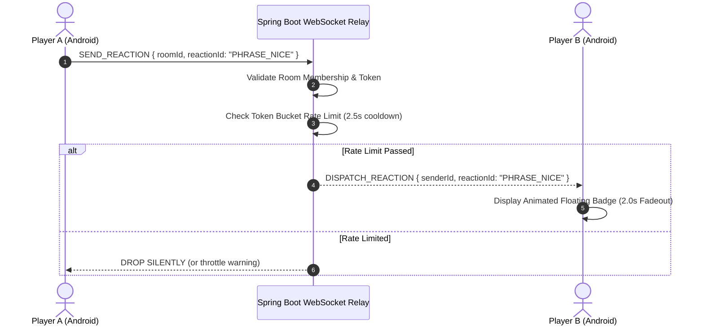

# Zynpath Temporary Reaction System

**Status:** Authoritative  
**Domain:** In-Match Communication, Ephemeral State, Safety & Moderation  

---

## 1. Architectural Motivation & Policy

Zynpath intentionally **prohibits freeform text chat** in all multiplayer modes.

By replacing arbitrary text input with a strictly defined, curated set of **Temporary Reactions**, Zynpath achieves four critical engineering and operational objectives:
1. **Zero Abuse & Toxicity**: Eliminates harassment, profanity, bullying, and predatory communication by design.
2. **Zero Moderation Burden**: No need for live chat moderators, algorithmic profanity filters, or abuse reporting pipelines.
3. **Zero Database Storage Costs**: Reactions are never written to disk or database tables. They exist only in volatile server RAM for seconds before garbage collection.
4. **Complete Regulatory Compliance**: Avoids user-generated content (UGC) compliance liabilities under COPPA, GDPR, and Google Play Families policy.

---

## 2. Curated Reaction Inventory

Players communicate exclusively via a floating emoji/phrase wheel containing the following predefined tokens:

### 2.1 Standard Phrases
- `"Wow!"`
- `"Nice!"`
- `"GG!"`
- `"Well played!"`
- `"Good luck!"`
- `"Amazing!"`
- `"Rematch!"`

### 2.2 Expressive Emojis
- 👏 (Applause / Respect)
- 🔥 (On Fire / Speed)
- 🤔 (Thinking / Puzzled)
- 😮 (Shocked / Close Call)
- 🤝 (Good Sportsmanship)
- ⚡ (Lightning Fast)
- 🏆 (Victory / Champion)

---

## 3. Ephemeral Relay Architecture

### 3.1 In-Memory Lifespan & Destruction
- The server maintains active room participants in a concurrent thread-safe collection (`ConcurrentHashMap<String, MatchRoom>`).
- When a reaction packet arrives, it is immediately serialized to peer channels in the room and discarded from server memory.
- **No logs, no database inserts, no cloud backup**.
- When the room closes, all associated session handles are destroyed.

---

## 4. Rate Limiting & Abuse Prevention

To prevent spamming or intentional visual disruption:
1. **Token Bucket Rate Limiter**:
   - Each player is allocated a burst capacity of 3 reactions.
   - Refill rate is strictly 1 reaction token every 2.5 seconds.
   - Messages sent while bucket is empty are dropped at the server gateway.
2. **Client-Side Mute Toggle**:
   - A single tap on the opponent's avatar allows players to mute all incoming reactions for the duration of the match.
   - Mute state is preserved in local session state.
3. **Room Membership Enforcement**:
   - The server validates that the authenticated sender UID belongs to the target `roomId`. Cross-room injection attempts trigger instant connection termination.
