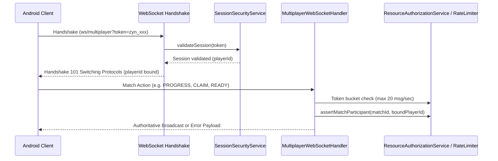

# Zynpath WebSocket Security Architecture

## 1. Overview and Connection Lifecycle
Zynpath uses real-time WebSockets for active competitive matches (`/ws/multiplayer`) and social presence updates (`/ws/presence`). Real-time communication requires equal or higher security diligence compared to standard HTTP REST APIs.

---

## 2. Authentication & Identity Binding
1. **Handshake Authentication**:
   - Connection URLs must supply a valid application session token either via `token` query parameter or `Sec-WebSocket-Protocol` / header.
   - Handshake validates the token against `SessionSecurityService`. If invalid or expired, handshake is rejected immediately with HTTP 401 Unauthorized.
2. **Strict Identity Binding**:
   - Upon successful handshake, the verified `playerId` is bound to the WebSocket session attributes (`session.getAttributes().put("playerId", playerId)`).
   - **Never trust client payloads for identity**: Client message payloads may attempt to supply a `playerId`. The handler explicitly ignores any client-supplied player ID and substitutes the authenticated, server-bound identity.
   - Cross-player impersonation inside WebSocket frames is physically impossible.

---

## 3. Subscription & Action Authorization
1. **Match Room Authorization**:
   - Before a client can send `PROGRESS`, `CLAIM`, `READY`, or `FORFEIT` frames for a `matchId`, the handler invokes `ResourceAuthorizationService.assertMatchParticipant(matchId, authenticatedPlayerId)`.
   - Players cannot snoop or inject events into matches they are not actively participating in.
2. **Mini League Room Authorization**:
   - Mini League actions (`READY`, `PROGRESS`, `EMOTE`) require active membership verified by `ResourceAuthorizationService.assertRoomMember(roomId, authenticatedPlayerId)`.
   - Arbitrary users cannot subscribe to a private room by guessing a room ID.

---

## 4. Per-Socket Message Rate Limiting
To protect against automated denial of service, memory exhaustion, or macro spamming:
- Each active WebSocket connection is governed by an in-memory token bucket rate limiter tracking message frequency.
- **Limit**: Maximum 20 messages per second per socket.
- If a client exceeds 20 messages in a 1-second window:
  - The frame is discarded.
  - A structured error frame (`{"type":"ERROR","code":"RATE_LIMIT_EXCEEDED","message":"Rate limit exceeded (max 20 msg/sec)"}`) is returned.
  - An audit event (`SecurityEventType.RATE_LIMIT_EXCEEDED`) is recorded.
  - Excessive violations trigger socket closure with status `1008 (Policy Violation)`.

---

## 5. Reconnection & Session Revocation
- When a client disconnects and reconnects (e.g. mobile radio transition from Wi-Fi to LTE), the new handshake must re-authenticate the session token.
- If a player signed out or had their session revoked (`SessionSecurityService.revokeSession`), reconnection attempts are denied.
- Active sockets associated with deleted accounts or security-revoked tokens are immediately terminated server-side.

---

## 6. Verification Status
- Component implementation: IMPLEMENTED (`MultiplayerWebSocketHandler`, `PresenceWebSocketHandler`).
- Unit/Integration tests: DEFERRED TO FINAL TESTING.
